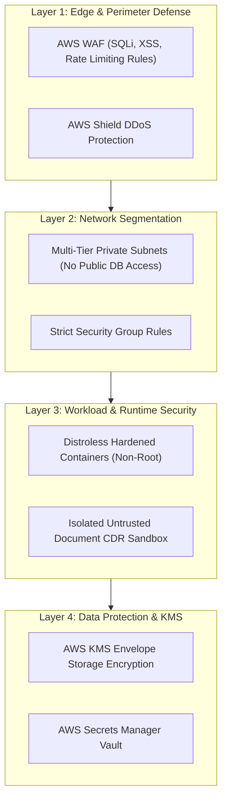

# Phase 1 — Infrastructure Security & Defense-in-Depth Specification

**Document Control Information**
- **Project Name:** SIH26100 — AI-Powered Integrated Bid Compliance Verification Platform for GeM Procurement
- **Organization:** Ministry of Petroleum & Natural Gas / CPCL
- **Document Version:** 1.0.0 (Phase 1 — Task 10 Infrastructure Security Specification)
- **Status:** DESIGN DRAFT / PENDING REVIEW
- **Security Classification:** INTERNAL
- **Mode:** DESIGN ONLY — ZERO CODE IMPLEMENTATION

---

## 1. Executive Summary & Purpose

This specification defines infrastructure defense-in-depth controls, security group rules, network segmentation, vulnerability management, and threat mitigations, integrating the Task 8 Security Architecture.

---

## 2. Infrastructure Defense-in-Depth Layers

---

## 3. Infrastructure Security Standards & Prohibitions

1. **Zero Public Storage / Databases:** S3 buckets, PostgreSQL instances, and Redis clusters MUST NOT possess public IP addresses or public ACL permissions.
2. **Zero Plaintext Secrets:** Hardcoded passwords, API tokens, or KMS private keys in Git repositories, Dockerfiles, or log outputs are strictly prohibited.
3. **No Unqualified Compliance Claims:** Software architecture and infrastructure designs do not claim unverified certifications ("100% secure", "zero vulnerabilities", "ISO certified", "OWASP certified").
