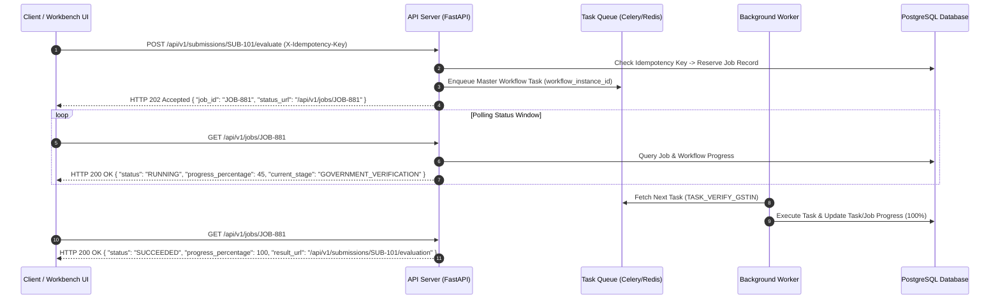

# Phase 1 — Async Job Orchestration, Queueing & Polling Architecture

## Overview

The **Async Job Orchestration, Queueing & Polling Architecture** defines how long-running workflow operations are scheduled, dispatched, monitored, and completed asynchronously within the **SIH26100 Bid Compliance Verification Platform**.

This architecture maps API request patterns (Task 3) to background execution queues, managing async `202 Accepted` job lifecycles, progress tracking, and client notification patterns.

---

## 1. Async Operation Mapping Hierarchy

To ensure clear isolation between API transport, workflow coordination, and background worker execution, the platform establishes a 5-tier execution mapping:

```
[API Request] (POST /api/v1/submissions/{id}/evaluate)
      │
      ▼
[Operation / Job] (job_id: 01J7JOB001 -> HTTP 202 Accepted + Location header)
      │
      ▼
[Workflow Instance] (workflow_instance_id: 01J7WF001)
      │
      ▼
[Workflow Task] (workflow_task_id: 01J7TASK001)
      │
      ▼
[Task Attempt] (task_attempt_id: 01J7ATT001 -> Worker execution)
```

| Entity Tier | Responsibility | Persistence Store | HTTP / API Visibility |
| :--- | :--- | :--- | :--- |
| **1. API Request** | Ingress REST payload parsing, authentication, rate limiting. | Web server logs / API gateway | Client-initiated HTTP call |
| **2. Job Reference (`Job`)** | Asynchronous operation handle tracking progress (0–100%). | Redis / PostgreSQL `jobs` | Returned as `202 Accepted` response with status URL |
| **3. Workflow Instance** | Master DAG state machine governing the multi-stage pipeline. | PostgreSQL `workflow_instances` | Accessible via `/api/v1/workflows/{id}` |
| **4. Workflow Task** | Granular execution node in DAG (e.g., `TASK_VERIFY_GSTIN`). | PostgreSQL `workflow_tasks` | Detailed task status in workflow status payload |
| **5. Task Attempt** | Single worker execution attempt with retry counts & logs. | PostgreSQL `task_attempts` | System/admin logs & audit traces |

---

## 2. HTTP `202 Accepted` Async Workflow Lifecycle



---

## 3. Queue Architecture & Worker Isolation

To prevent background job starvation, the queue architecture isolates background tasks into dedicated worker queues based on workload characteristics and SLA requirements:

```
                               ┌──► Queue: `high-priority` ──► High-Priority Workers (Officer actions, overrides)
                               │
[Master Queue Dispatcher] ─────┼──► Queue: `govt-verification` ──► Rate-Limited Govt Adapters
                               │
                               ├──► Queue: `ai-extraction` ──► GPU / CPU AI Workers (OCR / LLM Gateway)
                               │
                               └──► Queue: `batch-evaluation` ──► Core Rules Engine Workers
```

* **`high-priority` Queue:** Handles interactive officer workbench requests, manual override approvals, and user-blocking commands. Max SLA target: < 1000 ms wait.
* **`govt-verification` Queue:** Handles outbound government adapter verification tasks. Enforces domain-specific rate limits and concurrency caps per external API endpoint (Task 5).
* **`ai-extraction` Queue:** Handles document layout analysis and field extraction tasks dispatched to the AI Gateway (Task 4).
* **`batch-evaluation` Queue:** Handles core compliance rule AST evaluations and DAG dependency resolution tasks.

---

## 4. Job Status & Progress Tracking Model

The `Job` entity provides a standardized read-model schema for status polling and client progress visualization:

```json
{
  "job_id": "01J7JOB0000000000000000001",
  "operation_type": "BID_COMPLIANCE_EVALUATION",
  "submission_id": "01J7SUB0000000000000000001",
  "workflow_instance_id": "01J7WF0000000000000000001",
  "status": "RUNNING",
  "progress_percentage": 65,
  "current_stage": "GOVERNMENT_VERIFICATION",
  "total_tasks": 12,
  "completed_tasks": 7,
  "failed_tasks": 0,
  "pending_tasks": 5,
  "created_at": "2026-09-05T14:30:00Z",
  "updated_at": "2026-09-05T14:30:15Z",
  "estimated_completion_seconds": 10,
  "result_url": "/api/v1/submissions/01J7SUB0000000000000000001/evaluation",
  "error": null
}
```

### 4.1 Valid Job Status Enumeration
* **`QUEUED`:** Job registered and enqueued; pending worker pick-up.
* **`RUNNING`:** Active execution across one or more workflow stages.
* **`WAITING`:** Workflow execution paused at a Human Review Gate (`REQUIRES_HUMAN_REVIEW`).
* **`SUCCEEDED`:** All workflow tasks completed successfully; results available.
* **`PARTIAL`:** Non-critical tasks failed or timed out; partial evidence assembled and routed to review.
* **`FAILED`:** System-level unrecoverable execution failure encountered.
* **`CANCELLED`:** Job successfully terminated via graceful cancellation request.
