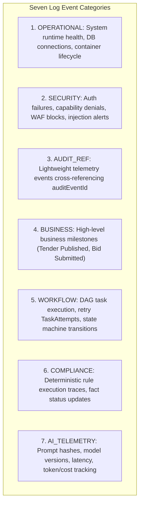
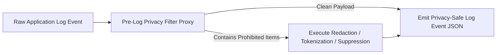

# Phase 1 — Structured Logging & Privacy-Safe Telemetry Architecture

**Document Control Information**
- **Project Name:** SIH26100 — AI-Powered Integrated Bid Compliance Verification Platform for GeM Procurement
- **Organization:** Ministry of Petroleum & Natural Gas / CPCL
- **Document Version:** 1.0.0 (Phase 1 — Task 9 Structured Logging Specification)
- **Status:** DESIGN DRAFT / PENDING REVIEW
- **Security Classification:** INTERNAL
- **Mode:** DESIGN ONLY — ZERO CODE IMPLEMENTATION

---

## 1. Executive Summary & Purpose

This specification defines the structured logging architecture and privacy-safe log telemetry pipeline for the SIH26100 platform. Logging provides the foundational diagnostic stream required to troubleshoot operational issues, monitor system health, and track workflow execution across asynchronous components.

The core logging axiom is:
> **"Logs MUST be structured, machine-readable, correlation-indexed, and privacy-safe. Logging MUST NEVER compromise data privacy, leak credentials, or duplicate authoritative audit ledgers without authorization."**

---

## 2. Log Event Model (`LogEvent` Schema)

All application subsystems generate log entries matching a standardized JSON `LogEvent` schema:

```json
{
  "$schema": "https://json-schema.org/draft/2020-12/schema",
  "title": "LogEvent",
  "type": "object",
  "required": [
    "timestamp",
    "log_id",
    "correlation_id",
    "severity",
    "event_category",
    "event_name",
    "component",
    "environment",
    "schema_version"
  ],
  "properties": {
    "timestamp": { "type": "string", "format": "date-time" },
    "log_id": { "type": "string", "pattern": "^[0-7][0-9A-HJKMNP-TV-Z]{25}$" },
    "correlation_id": { "type": "string" },
    "severity": { "type": "string", "enum": ["DEBUG", "INFO", "WARN", "ERROR", "CRITICAL"] },
    "event_category": { 
      "type": "string", 
      "enum": ["OPERATIONAL", "SECURITY", "AUDIT_REF", "BUSINESS", "WORKFLOW", "COMPLIANCE", "AI_TELEMETRY", "GOVT_TELEMETRY"] 
    },
    "event_name": { "type": "string" },
    "component": { "type": "string" },
    "environment": { "type": "string", "enum": ["development", "staging", "production", "sandbox"] },
    "schema_version": { "type": "string", "default": "1.0.0" },
    "context": {
      "type": "object",
      "properties": {
        "request_id": { "type": "string" },
        "workflow_id": { "type": "string" },
        "task_id": { "type": "string" },
        "task_attempt_id": { "type": "string" },
        "actor_id": { "type": "string" },
        "tenant_org_id": { "type": "string" },
        "tender_id": { "type": "string" },
        "bid_submission_id": { "type": "string" },
        "document_id": { "type": "string" },
        "error_code": { "type": "string" },
        "duration_ms": { "type": "number" }
      }
    },
    "message": { "type": "string" },
    "error_details": { "type": "object" }
  }
}
```

---

## 3. Log Severity Taxonomy & Use Guidelines

Logging levels are strictly enforced across five standardized severity tiers:

| Severity Level | Operational Meaning | Target Use Case & Event Types | Retention & Storage Policy |
|---|---|---|---|
| **DEBUG** | Fine-grained diagnostic information for development and staging troubleshooting. | Internal function entries, detailed AST node parsing steps, Redis cache hits/misses. | Enabled on-demand; 3-day retention in non-production environments. |
| **INFO** | Normal operational state changes and high-level progress milestones. | API request starts, job enqueuing, workflow state transitions (`RUNNING`), fact normalization completion. | Default production level; policy-controlled retention (e.g., 30 days). |
| **WARN** | Unexpected non-fatal occurrences or transient performance degradation. | Retry attempts, circuit breaker open warnings, soft timeout warnings, high memory utilization notices. | 60-day operational retention; monitored for anomaly spikes. |
| **ERROR** | Operation failures requiring technical investigation or human review fallback. | Failed task attempts, schema validation rejections, API 500 errors, government portal connection failures. | 90-day retention; triggers technical alert routing. |
| **CRITICAL** | Subsystem outages, audit hash chain corruption, or security breaches. | Database disconnection, SHA-256 audit chain mismatch, malware discovery, secret leak alert. | Immediate emergency alert dispatch; high-priority long-term retention. |

---

## 4. Seven Log Event Categories

To prevent log clutter and support targeted analysis, events are partitioned into seven distinct categories:



---

## 5. Privacy-Safe Logging & Absolute Prohibitions

To prevent application logs from becoming secondary data exfiltration channels or privacy violations, the architecture enforces strict logging prohibitions.



### 5.1 Absolute Prohibitions: What MUST NEVER Be Logged
The following items are **strictly forbidden** from appearing in raw log outputs under any circumstance:
1. **Authentication Secrets:** Raw user passwords, API keys, OAuth2 access tokens, refresh tokens, private RSA keys, client mTLS certificates.
2. **Database Credentials:** Database user passwords, connection string passwords, Redis `AUTH` tokens.
3. **Restricted Identifiers:** Full PAN numbers, Aadhaar numbers, personal bank account numbers, tax filing details.
4. **Sensitive PII:** Personal phone numbers, personal email addresses, director photos/signatures.
5. **Raw Document Payloads:** Complete uploaded PDF binary streams, raw document text, un-sanitized OCR text blocks.
6. **Government API Payloads:** Full raw XML/JSON verification payloads containing un-redacted personal registry data.
7. **HTTP Headers:** Full `Authorization` bearer headers, `Cookie` headers, internal secret headers.

### 5.2 Privacy Scrubbing & Redaction Rules
- **Header Suppression:** `Authorization` headers are sanitized to `Authorization: [REDACTED_BEARER_TOKEN]`.
- **Identifier Masking:** Sensitive business keys are masked (e.g., PAN: `XXXXX1234X`, GSTIN: `27XXXXX1234X1Z5`).
- **Data Minimization:** Logs capture entity ULIDs (e.g., `document_ulid: 01H...`) rather than full file contents.
- **Exception Sanitization:** Exception stack traces are scrubbed of local variable dumps containing raw document strings or database connection credentials.

---

## 6. Distinction Between Operational Logs and Authoritative Audit Ledger

The system maintains a fundamental boundary between operational logs and the tamper-evident audit ledger:

| Feature Dimension | Operational Logs (`LogEvent`) | Authoritative Audit Ledger (`AuditEvent`) |
|---|---|---|
| **Primary Purpose** | Operational diagnostics, performance monitoring, debugging | Legal accountability, non-repudiation, vigilance audits |
| **Storage Engine** | Ephemeral log collectors / Elasticsearch / OpenSearch | PostgreSQL Append-Only Ledger (`AuditEvent` table) |
| **Integrity Mechanism** | Standard log aggregation | Cryptographic SHA-256 sequential hash chain ($H_n = \text{SHA256}(H_{n-1} \parallel P_n)$) |
| **Data Scope** | Technical execution details, latencies, trace IDs | Formal business decisions, manual overrides, policy updates |
| **Retention Policy** | Short-to-medium policy retention (e.g., 30–90 days) | Long-term statutory policy retention with legal hold support |
| **Failure Reaction** | Non-blocking drop if log collector is down | Transaction rollback if audit write fails |
