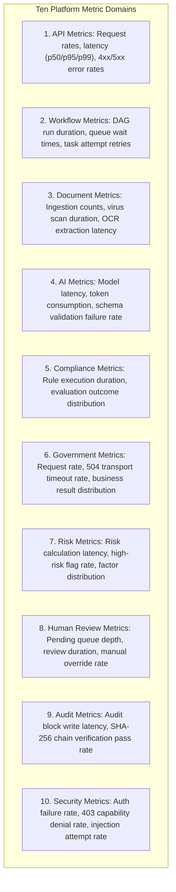
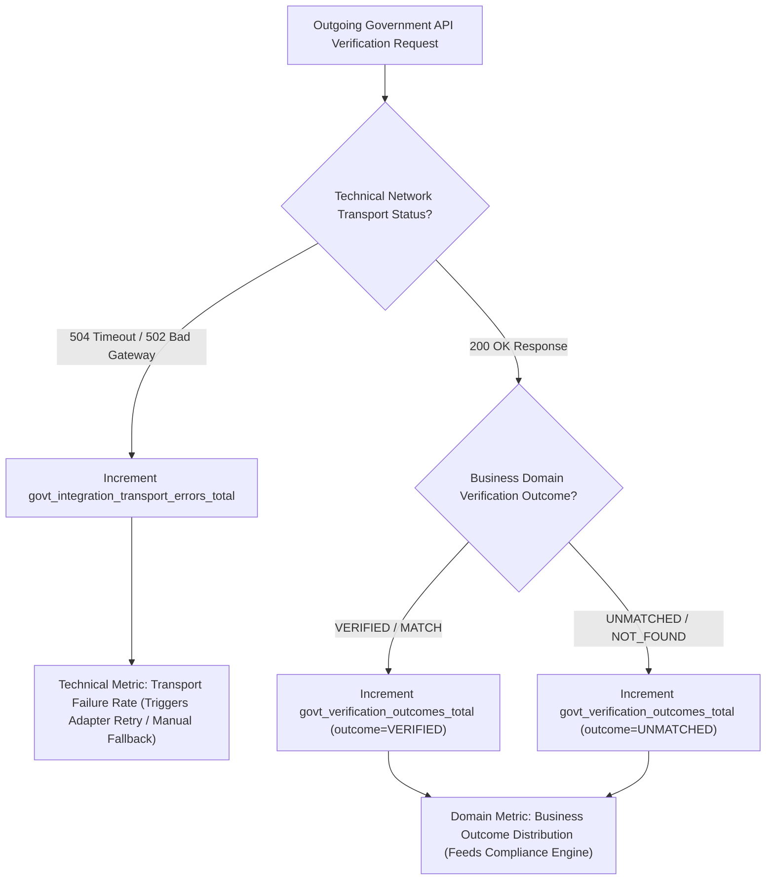

# Phase 1 — Platform Metrics & Metric Card Specification Architecture

**Document Control Information**
- **Project Name:** SIH26100 — AI-Powered Integrated Bid Compliance Verification Platform for GeM Procurement
- **Organization:** Ministry of Petroleum & Natural Gas / CPCL
- **Document Version:** 1.0.0 (Phase 1 — Task 9 Metrics Architecture Specification)
- **Status:** DESIGN DRAFT / PENDING REVIEW
- **Security Classification:** INTERNAL
- **Mode:** DESIGN ONLY — ZERO CODE IMPLEMENTATION

---

## 1. Executive Summary & Purpose

This specification defines the platform metrics model, collection strategy, and Metric Card specification standards for the SIH26100 platform. Quantitative metrics provide numerical visibility into system performance, processing throughput, error rates, AI extraction efficiency, government portal availability, compliance evaluation distributions, and queue health.

The foundational metrics axiom is:
> **"Metrics measure technical performance, system health, and processing trends. Technical metrics MUST NEVER be used as authoritative compliance evidence, and AI metrics MUST NEVER trigger automated bidder disqualification."**

---

## 2. Metric Subsystem Taxonomies

Metrics are categorized across ten functional subsystems:

---

## 3. High-Cardinality Control Rules & Label Protections

To prevent metric store memory exhaustion and cardinality explosion, metric labels are strictly governed:

### 3.1 Controlled Metric Labels (Allowed)
- `component` (e.g., `api-gateway`, `rule-engine`, `ai-gateway`, `mca-adapter`)
- `environment` (e.g., `production`, `staging`)
- `status_code` (e.g., `200`, `400`, `401`, `403`, `429`, `500`, `504`)
- `ai_provider` (e.g., `openai`, `anthropic`, `local-llm`)
- `govt_source` (e.g., `mca21`, `gstn`, `udyam`, `cbic`)
- `govt_mode` (e.g., `LIVE`, `SANDBOX`, `MOCK`, `MANUAL_FALLBACK`)
- `rule_outcome` (e.g., `PASS`, `FAIL`, `REQUIRES_HUMAN_REVIEW`)

### 3.2 Prohibited High-Cardinality Metric Labels (STRICTLY FORBIDDEN)
- **NO Raw Identifiers:** ULIDs (`user_ulid`, `tender_ulid`, `bid_submission_ulid`, `document_ulid`).
- **NO Sensitive PII:** Personal names, PAN numbers, GSTIN numbers, bank details.
- **NO Arbitrary Texts:** Prompt texts, document filenames, raw exception messages, URL paths with embedded IDs.

---

## 4. Standard Metric Card Specifications

All metric definitions in the SIH26100 platform must adhere to the standardized **Metric Card Specification**:

### Metric Card 1: API Request Latency
- **Metric Name:** `http_request_duration_seconds`
- **Purpose:** Measure end-to-end HTTP request processing latency across API routes.
- **Type:** Histogram (Buckets: 0.05s, 0.1s, 0.25s, 0.5s, 1s, 2.5s, 5s, 10s)
- **Unit:** Seconds
- **Source:** API Gateway / FastAPI Middleware
- **Dimensions / Labels:** `method`, `route`, `status_code`, `environment`
- **Aggregation:** `histogram_quantile(0.95, sum(rate(http_request_duration_seconds_bucket[5m])) by (le, route))`
- **Retention:** 30 days detailed; 1 year aggregated
- **Sensitivity:** `INTERNAL`
- **Owner:** Platform Engineering Team
- **Alert Relationship:** Linked to `API_LATENCY_DEGRADED_WARN` and `API_LATENCY_CRITICAL` alerts.
- **Known Limitations:** Does not include client-side network transit time.

### Metric Card 2: AI Provider Extraction Latency & Grounding
- **Metric Name:** `ai_extraction_duration_seconds`
- **Purpose:** Measure execution latency of structured JSON extraction calls to AI providers.
- **Type:** Histogram (Buckets: 0.5s, 1s, 2s, 5s, 10s, 30s)
- **Unit:** Seconds
- **Source:** Pre-AI Privacy Gateway
- **Dimensions / Labels:** `ai_provider`, `model_name`, `schema_version`, `grounding_status`
- **Aggregation:** `sum(rate(ai_extraction_duration_seconds_count[5m])) by (ai_provider, grounding_status)`
- **Retention:** 90 days
- **Sensitivity:** `INTERNAL`
- **Owner:** AI Engineering Team
- **Alert Relationship:** Linked to `AI_PROVIDER_LATENCY_SPIKE` alert.
- **Known Limitations:** Dependent on external cloud AI network conditions.

### Metric Card 3: Government Transport Failure Rate
- **Metric Name:** `govt_integration_transport_errors_total`
- **Purpose:** Count technical network transport failures (timeouts, 502/504) per government portal.
- **Type:** Counter
- **Unit:** Integer Count
- **Source:** Government Integration Adapter Gateway
- **Dimensions / Labels:** `govt_source`, `govt_mode`, `error_type` (e.g., `timeout`, `connection_refused`, `502_bad_gateway`)
- **Aggregation:** `sum(rate(govt_integration_transport_errors_total[5m])) by (govt_source)`
- **Retention:** 90 days
- **Sensitivity:** `INTERNAL`
- **Owner:** Integration Engineering Team
- **Alert Relationship:** Linked to `GOVT_PORTAL_TIMEOUT_SPIKE` and `CIRCUIT_BREAKER_TRIPPED` alerts.
- **Known Limitations:** Measures network transport errors only; does not measure domain business verification outcomes (`UNMATCHED`).

### Metric Card 4: Compliance Rule Evaluation Outcome Rate
- **Metric Name:** `compliance_rule_evaluations_total`
- **Purpose:** Track distribution of rule execution outcomes across policy versions.
- **Type:** Counter
- **Unit:** Integer Count
- **Source:** Deterministic AST Rule Engine
- **Dimensions / Labels:** `rule_id`, `policy_version`, `rule_outcome` (`PASS`, `FAIL`, `REQUIRES_HUMAN_REVIEW`)
- **Aggregation:** `sum(rate(compliance_rule_evaluations_total[1h])) by (policy_version, rule_outcome)`
- **Retention:** 1 year
- **Sensitivity:** `INTERNAL`
- **Owner:** Compliance Rules Team
- **Alert Relationship:** Linked to `HIGH_HUMAN_REVIEW_ROUTING_SPIKE` alert.
- **Known Limitations:** Operational count only; authoritative trace remains in PostgreSQL `EvaluationSnapshot`.

---

## 5. Critical Distinction: Technical Transport Failure vs. Business Verification Result

The metrics architecture preserves strict isolation between technical transport issues and business outcomes:

---

## 6. Summary Matrix of Primary Platform Metrics

| Subsystem | Metric Name | Metric Type | Key Labels | Alert Trigger Condition |
|---|---|---|---|---|
| **API** | `http_requests_total` | Counter | `method`, `route`, `status_code` | 5xx error rate $> 5\%$ in 5 min |
| **Workflow** | `workflow_instances_active` | Gauge | `workflow_state` | Active instances $> 1000$ |
| **Document** | `document_ingestion_viruses_total` | Counter | `file_type` | Virus detected $> 0$ (Immediate) |
| **AI Gateway** | `ai_schema_validation_failures_total` | Counter | `ai_provider`, `schema_version` | Failure rate $> 10\%$ in 5 min |
| **Govt Adapter** | `govt_circuit_breaker_state` | Gauge | `govt_source`, `state` | State == `OPEN` (Immediate) |
| **Compliance** | `compliance_evaluations_total` | Counter | `policy_version`, `outcome` | `HUMAN_REVIEW` rate $> 30\%$ |
| **Human Review**| `human_review_queue_depth` | Gauge | `tenant_org_id`, `priority` | Queue depth $> 100$ items |
| **Audit Ledger**| `audit_hash_verification_status` | Gauge | `table_name` | Status == `0` (TAMPERED) |
| **Security** | `authz_capability_denials_total` | Counter | `component`, `capability` | Denial rate $> 50$ per min |
