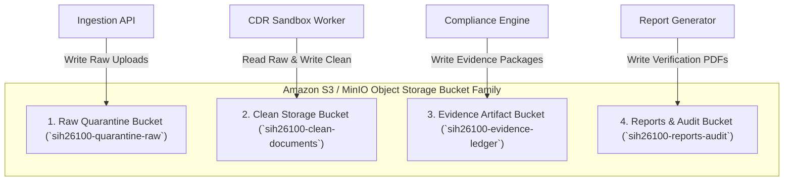

# Phase 1 — Object Storage Deployment & Lifecycle Specification

**Document Control Information**
- **Project Name:** SIH26100 — AI-Powered Integrated Bid Compliance Verification Platform for GeM Procurement
- **Organization:** Ministry of Petroleum & Natural Gas / CPCL
- **Document Version:** 1.0.0 (Phase 1 — Task 10 Object Storage Specification)
- **Status:** DESIGN DRAFT / PENDING REVIEW
- **Security Classification:** INTERNAL
- **Mode:** DESIGN ONLY — ZERO CODE IMPLEMENTATION

---

## 1. Executive Summary & Purpose

This specification defines the object storage deployment architecture (Amazon S3 / MinIO API compatibility) for managing raw bidder uploads, sanitized disarmed documents, extracted evidence artifacts, and system report files.

The core storage security rule is:
> **"Original bidder documents are preserved immutably with SHA-256 digests. Raw uploads reside in quarantine buckets, sanitized derivatives reside in clean buckets, and legal holds override dynamic retention purges."**

---

## 2. Bucket Taxonomy & Security Isolation

---

## 3. Storage Bucket Policy & Lifecycle Specifications

| Bucket Name | Content Classification | Encryption Standard | Object Versioning | Retention & Lifecycle Policy |
|---|---|---|---|---|
| **`sih26100-quarantine-raw`** | Raw untrusted bidder file uploads | KMS SSE-S3 | Enabled | Auto-purge raw uploads 30 days after document processing |
| **`sih26100-clean-documents`**| Sanitized disarmed PDFs & extracted text | KMS SSE-KMS | Enabled | Policy-controlled retention based on tender lifecycle |
| **`sih26100-evidence-ledger`**| Immutable evidence packages & JSON proofs | KMS SSE-KMS | Enabled (Locked) | Permanent retention / Legal hold override enabled |
| **`sih26100-reports-audit`** | Generated evaluation reports & summaries | KMS SSE-KMS | Enabled | Retained for statutory audit period (e.g., 10 years) |

---

## 4. Evidence Integrity Protection

1. **SHA-256 Payload Hashing & Provenance:** Original bidder submissions preserve original artifact identity and SHA-256 payload digests computed at ingestion (`EvidenceRecord.sha256_hash`), establishing explicit provenance between original artifacts and sanitized derivatives.
2. **Object Lock / WORM Governance:** Original bidder submissions MAY use object-lock/WORM controls where required by approved retention, legal-hold, and evidence-governance policy. Legal hold overrides policy-controlled dynamic retention purges.
