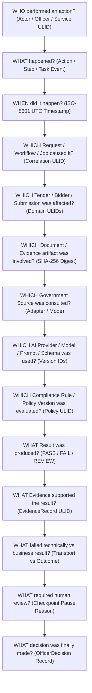
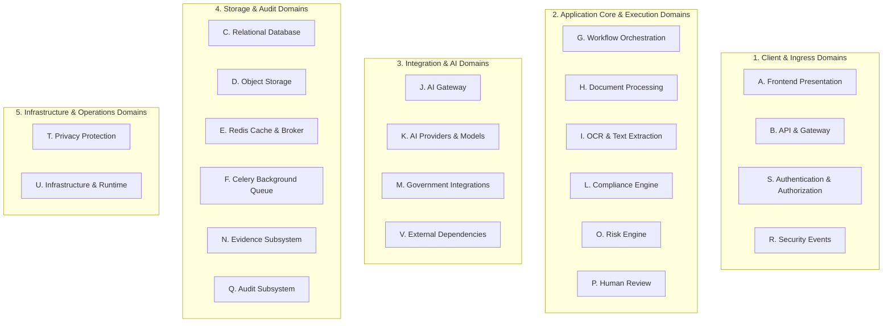

# Phase 1 — Observability, Monitoring & Operational Architecture Specification

**Document Control Information**
- **Project Name:** SIH26100 — AI-Powered Integrated Bid Compliance Verification Platform for GeM Procurement
- **Organization:** Ministry of Petroleum & Natural Gas / CPCL (Chennai Petroleum Corporation Limited)
- **Document Version:** 1.0.0 (Phase 1 — Task 9 Observability Baseline)
- **Status:** DESIGN DRAFT / PENDING REVIEW
- **Security Classification:** INTERNAL
- **Mode:** DESIGN ONLY — ZERO CODE IMPLEMENTATION

---

## 1. Executive Summary & Purpose

### 1.1 Purpose
### 1.2 Cross-Cutting Operational Telemetry Boundary Rule
> **"Operational telemetry is diagnostic information and must not independently modify authoritative compliance facts, compliance evaluations, risk outcomes, or qualification outcomes."**

---

## 2. Core Observability Axiom & Traceability Chain

The observability architecture preserves the platform's core responsibility chain:

$$\text{AI INTERPRETS} \longrightarrow \text{AUTHORIZED SOURCES VERIFY} \longrightarrow \text{RULES EVALUATE} \longrightarrow \text{EVIDENCE PROVES} \longrightarrow \text{HUMAN APPROVES}$$

Observability MUST make this chain end-to-end traceable. An authorized operator, auditor, or engineer must be able to unambiguously diagnose:

---

## 3. Twenty Foundational Observability Principles

The observability architecture is governed by twenty core principles:

| # | Observability Principle | Architectural Meaning & Application |
|---|---|---|
| 1 | **Structured Observability** | All log events, metrics, and trace spans adhere to strict machine-readable JSON schemas with standardized core attributes. |
| 2 | **Correlation-First Diagnostics** | Correlation identifiers SHOULD be propagated whenever a causal relationship exists across HTTP APIs, Celery workers, AI calls, and government adapters. |
| 3 | **Async Workflow Traceability** | Asynchronous jobs preserve parent-child span context and distinguish operation identity from retry `TaskAttempt` instances. |
| 4 | **Evidence-Aware Observability** | Telemetry logs evidence identifiers (`evidenceRecordId`, `sourceDocumentId`) to allow instant correlation with raw input sources. |
| 5 | **Security-Aware Logging** | Security-relevant events (authentication failures, capability denials, injection attempts) generate structured security signals. |
| 6 | **Privacy-Aware Telemetry** | Unnecessary PII, PAN numbers, bank details, passwords, and API secrets are strictly scrubbed before telemetry ingestion via privacy-safe pre-log sanitization. |
| 7 | **Least-Privilege Access** | Operational dashboards, log streams, and diagnostic views enforce fine-grained RBAC access control based on user roles. |
| 8 | **Audit/Telemetry Separation** | Ephemeral operational telemetry is explicitly separated from the authoritative SHA-256 tamper-evident `AuditEvent` ledger. |
| 9 | **No Sensitive Leakage** | Telemetry pipelines act as strict privacy boundaries, preventing logs from becoming secondary exfiltration paths. |
| 10 | **No Secrets in Telemetry** | API keys, mTLS private keys, JWT secrets, and DB passwords are filtered out of all log streams and trace attributes. |
| 11 | **Deterministic Rule Observability**| Rule evaluations log exact AST node execution paths, fact inputs, and policy version IDs without modifying rule outcomes. |
| 12 | **AI Provenance Observability** | AI telemetry captures provider, model version, prompt hash, schema version, latency, and grounding status. AI remains non-authoritative. |
| 13 | **Government Integration Visibility**| Integrations track mode (`LIVE/SANDBOX/MOCK/MANUAL_FALLBACK`), technical transport status, business result, and source freshness. |
| 14 | **Human-Review Observability** | Review queues, pending review age, override frequency, and four-eyes review events are tracked in real time. |
| 15 | **Failure Transparency** | Telemetry clearly distinguishes technical transport failures (`504 Timeout`) from domain business verification outcomes (`UNMATCHED`). |
| 16 | **Alert Quality over Quantity** | Production alerts mandate actionable runbooks, diagnostic context, immediate action steps, and deduplication rules. |
| 17 | **Policy-Controlled Retention** | Telemetry retention windows are policy-configured per data classification and support dual-control legal holds. |
| 18 | **Cost-Aware Telemetry** | High-volume debug logs and trace sampling are dynamically controlled to prevent excessive compute/storage costs. |
| 19 | **Tamper-Evident Audit Lineage** | Operational logs cross-reference `auditEventId` records to link telemetry directly to tamper-evident audit blocks. |
| 20 | **Operational Resilience** | Telemetry pipeline failures execute non-blocking fallbacks to ensure application transactions are never aborted by log drops. |

---

## 4. Overview of Twenty-Two Observability Domains

The platform defines structured observability across twenty-two distinct operational domains:

---

## 5. Defense-in-Depth Observability Layering

| System Layer | Primary Observability Goal | Dominant Telemetry Type | Primary Diagnostic Metric |
|---|---|---|---|
| **Presentation / UI** | Monitor user experience, client errors, session health | Structured Console / HTTP Telemetry | Page load latency, 4xx/5xx API errors |
| **API Gateway** | Throttling, routing, authentication & rate limits | Access Logs & Gateway Metrics | Request rate (RPS), 429 throttling rate |
| **Application Core** | Business logic execution, fact processing, RBAC | Structured JSON Logs & Traces | Task execution duration, 500 error rate |
| **Workflow Engine** | State machine transitions, DAG execution, retries | Workflow Telemetry Events | Queue depth, pending task age, retry rate |
| **AI Gateway** | Provider latency, token usage, schema validation | AI Telemetry & Provenance Logs | Extraction latency, schema failure rate |
| **Govt Adapters** | Technical transport status vs business outcomes | Adapter Metrics & Correlation Logs | Circuit breaker state, 504 timeout rate |
| **Rules Engine** | AST calculation execution, policy version usage | Trace Logs & Evaluation Snapshots | Rule evaluation latency, snapshot status |
| **Database / Storage** | Connection pooling, query performance, MinIO IOPS | Database Metrics & Query Traces | Active connections, slow query count |
| **Audit Ledger** | SHA-256 hash-chain integrity verification | Security Logs & Integrity Telemetry | Hash-chain verification pass/fail status |

---

## 6. Relationship to Tasks 1–8 Frozen Baseline

Task 9 strictly honors the frozen baseline established in Tasks 1–8:
- **Task 1 (Modular Monolith):** Observability covers all modular monolith domain boundaries without introducing microservices lock-in.
- **Task 2 (Data Architecture):** Preserves domain entities, ULID identifiers, and policy-controlled retention.
- **Task 3 (API Contracts):** Reuses `/api/v1` conventions, `X-Correlation-ID`, `X-Idempotency-Key`, and RFC 7807 error models.
- **Task 4 (AI Architecture):** Enforces Non-Authoritative AI boundary; AI metrics cannot trigger compliance outcomes.
- **Task 5 (Government Integration):** Preserves Quad-Operating Modes and technical transport failure vs business outcome separation.
- **Task 6 (Compliance Engine):** Observability traces AST rule executions and snapshot creation; `MISSING_EVIDENCE` strictly routes to human review.
- **Task 7 (Workflow Orchestration):** Observability tracks DAG execution, at-least-once retries, and checkpoint pauses while distinguishing operation identity from `TaskAttempt` retries.
- **Task 8 (Security Architecture):** Enforces defense-in-depth, 5D authorization tracking, pre-AI privacy scrubbing, and SHA-256 audit chain separation.

---

## 7. Out-of-Scope & Implementation Notice

- **Zero Application Source Code:** No Python code, FastAPI endpoints, Pydantic implementation models, SQLAlchemy ORMs, or frontend scripts are created in Task 9.
- **Zero Tool Deployments:** No Prometheus server, Grafana containers, OpenTelemetry collectors, ELK stacks, or CloudWatch instances are deployed.
- **Zero Secrets / Credentials:** No real API keys, passwords, or cloud tokens are created or hardcoded.
- **Status:** DESIGN DRAFT / PENDING REVIEW. Task 10 remains NOT STARTED.
