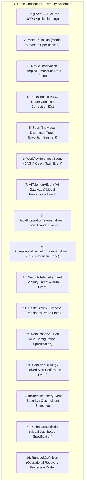

# Phase 1 — Observability Data Model & Schema Architecture Specification

**Document Control Information**
- **Project Name:** SIH26100 — AI-Powered Integrated Bid Compliance Verification Platform for GeM Procurement
- **Organization:** Ministry of Petroleum & Natural Gas / CPCL
- **Document Version:** 1.0.0 (Phase 1 — Task 9 Observability Data Model Specification)
- **Status:** DESIGN DRAFT / PENDING REVIEW
- **Security Classification:** INTERNAL
- **Mode:** DESIGN ONLY — ZERO CODE IMPLEMENTATION

---

## 1. Executive Summary & Purpose

This specification defines the conceptual telemetry schemas and data models for the SIH26100 platform's observability subsystem. It establishes formal contracts for log events, metric observations, trace spans, workflow events, AI telemetry, government integration telemetry, compliance traces, security events, health statuses, alert rules, incident events, dashboard specifications, and runbook models.

The governing telemetry storage principle is:
> **"Telemetry data models are designed for high-throughput ingestion in ephemeral monitoring platforms. They are explicitly isolated from the authoritative PostgreSQL domain database and SHA-256 audit ledger."**

---

## 2. Telemetry Entity & Schema Catalog

The system defines sixteen conceptual telemetry data schemas:

---

## 3. Storage Allocation Matrix: Telemetry Store vs. Authoritative Database

The table below defines where each data model resides within the system architecture:

| Telemetry Schema | Target Storage Subsystem | Storage Engine Type | Primary Access Pattern | Integrity Mechanism |
|---|---|---|---|---|
| `LogEvent` | Ephemeral Log Aggregator | OpenSearch / Elasticsearch | Full-text search by `correlation_id` | Standard log index retention |
| `MetricObservation` | Time Series Database (TSDB) | Prometheus / VictoriaMetrics | Range query & PromQL aggregation | Metric TSDB downsampling |
| `Span` | Distributed Tracing System | Jaeger / Tempo | Distributed trace graph lookup | Tail-based trace sampling |
| `WorkflowTelemetryEvent` | Ephemeral Log Aggregator | OpenSearch | Chronological job timeline lookup | Log index retention |
| `AITelemetryEvent` | Ephemeral Log Aggregator | OpenSearch | AI provenance & token analysis | Log index retention |
| `GovtIntegrationTelemetryEvent` | Ephemeral Log Aggregator | OpenSearch | Transport failure & latency analysis | Log index retention |
| `SecurityTelemetryEvent` | SIEM / Security Log Store | OpenSearch (Security Index) | Real-time security alert correlation | Encrypted long-term archive |
| `AlertEvent` | Alert Management Store | Alertmanager / PagerDuty | Active firing alert list | Alert state machine |
| `AuditEvent` (**Authoritative**) | **PostgreSQL Audit Ledger** | **PostgreSQL Database** | **Vigilance & Legal Audit Query** | **Cryptographic SHA-256 Hash Chain** |
| `EvaluationSnapshot` (**Authoritative**)| **PostgreSQL Domain DB** | **PostgreSQL Database** | **Deterministic Rule Replay** | **Database Transaction Commit** |

---

## 4. Key Schema Contracts & Relationships

1. **Correlation Key Uniformity:** All telemetry schemas (`LogEvent`, `Span`, `WorkflowTelemetryEvent`, `AITelemetryEvent`, `GovtIntegrationTelemetryEvent`, `SecurityTelemetryEvent`) mandate a string `correlation_id` attribute matching the Crockford ULID issued at request ingress.
2. **Isolation from Application Schemas:** Telemetry data schemas are defined as documentation contracts for monitoring systems. No SQLAlchemy models, ORM tables, or database migrations are created for telemetry events.
