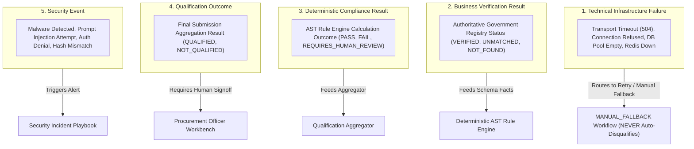

# Phase 1 — Master Operational Failure Taxonomy Specification

**Document Control Information**
- **Project Name:** SIH26100 — AI-Powered Integrated Bid Compliance Verification Platform for GeM Procurement
- **Organization:** Ministry of Petroleum & Natural Gas / CPCL
- **Document Version:** 1.0.0 (Phase 1 — Task 9 Failure Taxonomy Specification)
- **Status:** DESIGN DRAFT / PENDING REVIEW
- **Security Classification:** INTERNAL
- **Mode:** DESIGN ONLY — ZERO CODE IMPLEMENTATION

---

## 1. Executive Summary & Purpose

This specification defines the master operational failure taxonomy for the SIH26100 platform. Precise error classification is required to ensure that system failures are properly categorized, logged, routed, alerted, and resolved without corrupting compliance evaluation outcomes.

The foundational failure classification axiom is:
> **"Telemetry MUST explicitly distinguish TECHNICAL FAILURES from BUSINESS VERIFICATION RESULTS, COMPLIANCE RESULTS, QUALIFICATION OUTCOMES, and SECURITY EVENTS."**

---

## 2. Distinction Between Five Outcome Spheres

The system segregates outcomes into five distinct operational spheres:

---

## 3. Sixteen Master Operational Failure Categories

The platform classifies all operational anomalies across sixteen standardized failure codes:

| Failure Code | Category Name | Description & Example Trigger | Default Subsystem Reaction | Impact on Compliance Evaluation |
|---|---|---|---|---|
| **FL-01** | `VALIDATION_FAILURE` | HTTP request JSON fails OpenAPI schema check. | HTTP 400 Bad Request | Rejects API Request |
| **FL-02** | `DEPENDENCY_FAILURE` | PostgreSQL DB or Redis queue unreachable. | HTTP 503 Service Unavailable | Pauses Processing |
| **FL-03** | `TIMEOUT` | Government portal or AI Gateway call exceeds limit. | Retries with backoff jitter | Routes to `MANUAL_FALLBACK` (NEVER `FAIL`) |
| **FL-04** | `RATE_LIMIT` | API Gateway or external API rate limit breached. | HTTP 429 Too Many Requests | Throttles Requests |
| **FL-05** | `AUTHENTICATION_FAILURE` | Invalid JWT token, expired OIDC session. | HTTP 401 Unauthorized | Denies Access |
| **FL-06** | `AUTHORIZATION_FAILURE` | Insufficient capability or org context mismatch. | HTTP 403 Forbidden | Denies Action |
| **FL-07** | `MALFORMED_RESPONSE` | AI provider or Govt portal returns invalid format. | Schema rejection retry | Routes to Local Fallback / Review |
| **FL-08** | `PROVIDER_FAILURE` | Cloud AI API returns 502/503 server error. | Dynamic provider failover | Switches AI Provider |
| **FL-09** | `RESOURCE_EXHAUSTION` | Worker container CPU/RAM limit breached. | Worker restart / queue pause | Re-enqueues TaskAttempt |
| **FL-10** | `INTERNAL_PROCESSING_FAILURE` | Unhandled Python exception in task worker. | Log error, emit alert | Task Retries / DLQ |
| **FL-11** | `DATA_QUALITY_FAILURE` | Fact missing or evidence confidence low. | Flag data quality gap | Routes to `REQUIRES_HUMAN_REVIEW` |
| **FL-12** | `SECURITY_EVENT` | Virus detected or prompt injection attempt. | Isolate file, emit alert | Rejects File / Flags High Risk |
| **FL-13** | `HUMAN_REVIEW_REQUIRED` | Policy rule requires officer manual signoff. | Pause workflow checkpoint | Awaits Officer Decision |
| **FL-14** | `CANCELLATION` | User requests graceful workflow termination. | Transition to `CANCELLED` | Halts Execution |
| **FL-15** | `POLICY_CONFLICT` | Conflicting rule definitions in PolicyVersion. | Reject policy publish | Prevents Tender Evaluation |
| **FL-16** | `CONFIGURATION_ERROR` | Missing environment variable on startup. | Process startup abort | Prevents Container Start |

---

## 4. Failure Isolation Guarantees

1. **Infrastructure Failures Are Not Compliance Failures:** A network transport timeout (`FL-03`) or dependency failure (`FL-02`) NEVER marks a bidder as `NOT_QUALIFIED`. The task routes to manual fallback or retry queues.
2. **Security Events Are Not Automated Disqualifications:** Discovering an unreadable scan or prompt injection attempt (`FL-12`) flags the document for security containment and human review; it does not corrupt the deterministic rule engine.
