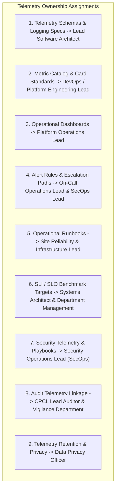

# Phase 1 — Telemetry Governance & Operational Change Management Architecture

**Document Control Information**
- **Project Name:** SIH26100 — AI-Powered Integrated Bid Compliance Verification Platform for GeM Procurement
- **Organization:** Ministry of Petroleum & Natural Gas / CPCL
- **Document Version:** 1.0.0 (Phase 1 — Task 9 Observability Governance Specification)
- **Status:** DESIGN DRAFT / PENDING REVIEW
- **Security Classification:** INTERNAL
- **Mode:** DESIGN ONLY — ZERO CODE IMPLEMENTATION

---

## 1. Executive Summary & Purpose

This specification defines the observability governance, telemetry schema versioning, metric catalog management, and change control framework for the SIH26100 platform. Observability configurations (metric cards, alert rules, dashboard specs, runbooks) are core software artifacts requiring formal ownership, versioning, and change review.

The governing observability governance principle is:
> **"Observability artifacts MUST be version-controlled, explicitly owned, and modified through governed change management. Modifying production alert rules or metric schemas requires formal architectural review."**

---

## 2. Telemetry Ownership & Governance Matrix

System observability responsibilities are assigned across nine core operational areas:

---

## 3. Telemetry Schema Versioning & Change Control Rules

1. **Semantic Versioning for Telemetry Schemas:** Telemetry event schemas (`LogEvent`, `AITelemetryEvent`, `GovtIntegrationTelemetryEvent`) use Semantic Versioning (`MAJOR.MINOR.PATCH`).
   - Breaking schema changes (e.g., removing a mandatory attribute) increment the `MAJOR` version (`2.0.0`).
   - Backward-compatible additions increment the `MINOR` version (`1.1.0`).
2. **Alert Rule Modification Governance:** Production alert rule modifications require pull request approval from both an Infrastructure Lead and Security Operations Lead.
3. **Metric Catalog Registration:** Adding a new platform metric requires registering a formal Metric Card specification in `docs/PHASE_1_METRICS_ARCHITECTURE.md` prior to code deployment.
4. **Quarterly Telemetry Review:** System architects, auditors, and security leads conduct a quarterly review of alerting quality, SLO performance, log retention compliance, and cost metrics.
