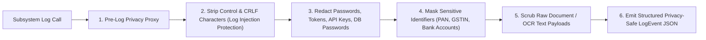

# Phase 1 — Observability Security & Telemetry Protection Architecture

**Document Control Information**
- **Project Name:** SIH26100 — AI-Powered Integrated Bid Compliance Verification Platform for GeM Procurement
- **Organization:** Ministry of Petroleum & Natural Gas / CPCL
- **Document Version:** 1.0.0 (Phase 1 — Task 9 Observability Security Specification)
- **Status:** DESIGN DRAFT / PENDING REVIEW
- **Security Classification:** INTERNAL
- **Mode:** DESIGN ONLY — ZERO CODE IMPLEMENTATION

---

## 1. Executive Summary & Purpose

This specification defines the security architecture protecting the platform's observability, logging, metric, and tracing infrastructure. Observability systems process telemetry from all application domains. If telemetry pipelines are not properly secured, they become high-value targets for attackers seeking sensitive PII, log injection vectors, alert suppression exploits, or metric poisoning.

The core observability security principle is:
> **"Observability systems MUST be protected with the same rigor as primary data stores. Telemetry pipelines MUST prevent log injection, sensitive data leakage, metric tampering, and alert suppression."**

---

## 2. Telemetry Threat Taxonomy & Security Controls

The architecture mitigates ten specific observability threats:

| Threat ID | Telemetry Threat Name | Attack Vector / Description | Architectural Security Control |
|---|---|---|---|
| **T-OBS-01** | **Sensitive Data Leakage** | Log events capture unredacted passwords, API keys, PAN numbers, or PII. | Pre-Log Privacy Filter Proxy scrubbing headers, secrets, and PII before log emission. |
| **T-OBS-02** | **Log Injection Attacks** | Malicious uploader embeds newline (`\n`) or CRLF characters in filenames/prompts to forge fake log entries. | Log message sanitization stripping control characters; structured JSON log formatting. |
| **T-OBS-03** | **Metric Poisoning** | Attacker injects fake metric points or high-cardinality labels to disrupt monitoring alerts or exhaust RAM. | Label whitelist enforcement; metric ingestion restricted to authenticated internal service accounts. |
| **T-OBS-04** | **Alert Suppression** | Malicious insider silences or modifies production alert rules to conceal unauthorized actions. | Alert rule modification restricted to `SystemAdmin`; changes logged to tamper-evident audit ledger. |
| **T-OBS-05** | **Trace Manipulation** | Attacker injects forged W3C `traceparent` headers to disrupt distributed tracing correlation. | API Gateway validates incoming trace headers; injects internal verified correlation IDs. |
| **T-OBS-06** | **Unauthorized Telemetry Access** | Unauthorized user views system log streams or operational dashboards containing sensitive metadata. | Fine-grained RBAC + Capability authorization matrix governing observability endpoints. |
| **T-OBS-07** | **Log Flooding / DoS** | Attacker floods system with invalid requests to exhaust log storage disk space. | Ingress API rate limiting, dynamic log level controls, and log storage quota caps. |
| **T-OBS-08** | **Retention Bypass** | Automated log cleanup script deletes logs subject to an active legal investigation. | Dual-control `LegalHold` engine freezing retention cleanup for locked tenders. |
| **T-OBS-09** | **Observability Platform Outage**| Failure of log aggregator causes main application API transactions to block or crash. | Non-blocking, asynchronous telemetry emission with bounded memory buffers. |
| **T-OBS-10** | **Credential Leak in Error Logs**| System exception dumps raw database connection string containing DB password into error logs. | Global exception handler scrubbing connection strings and environment variables before logging. |

---

## 3. Pre-Log Privacy Filter Architecture

---

## 4. Telemetry Non-Blocking Failure Resilience

To prevent log pipeline outages from degrading application availability:
- **Asynchronous Emission:** Log events and trace spans are written to in-memory ring buffers and dispatched asynchronously by background logging threads.
- **Bounded Buffer Drop Policy:** If the log aggregator is unreachable or log ring buffers fill up, the logging proxy drops non-critical `DEBUG` and `INFO` log events rather than blocking main API request threads. Critical `AUDIT` events execute inside database transactions independently of ephemeral log channels.
