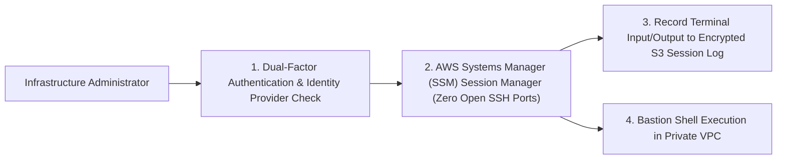

# Phase 1 — Operational Access & Privileged Session Governance Specification

**Document Control Information**
- **Project Name:** SIH26100 — AI-Powered Integrated Bid Compliance Verification Platform for GeM Procurement
- **Organization:** Ministry of Petroleum & Natural Gas / CPCL
- **Document Version:** 1.0.0 (Phase 1 — Task 10 Operational Access Specification)
- **Status:** DESIGN DRAFT / PENDING REVIEW
- **Security Classification:** INTERNAL
- **Mode:** DESIGN ONLY — ZERO CODE IMPLEMENTATION

---

## 1. Executive Summary & Purpose

This specification defines operational administrative access, Bastion/SSM session controls, temporary privilege elevation, and break-glass procedures.

---

## 2. Privileged Access Architecture

---

## 3. Break-Glass Procedure Controls

1. **Dual-Control Approval:** Emergency break-glass access to production database shells requires concurrent authorization tokens from SystemAdmin and Lead Auditor.
2. **Time-Bound Elevation:** Temporary IAM policy elevation automatically expires after a maximum duration of 2 hours.
3. **Exhaustive Session Auditing:** All commands executed during an administrative break-glass session are recorded verbatim to encrypted audit storage.
