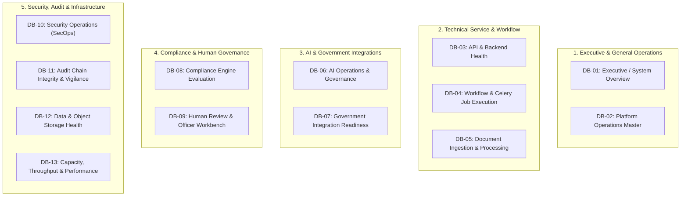

# Phase 1 — Operational Dashboards Architecture Specification

**Document Control Information**
- **Project Name:** SIH26100 — AI-Powered Integrated Bid Compliance Verification Platform for GeM Procurement
- **Organization:** Ministry of Petroleum & Natural Gas / CPCL
- **Document Version:** 1.0.0 (Phase 1 — Task 9 Operational Dashboards Specification)
- **Status:** DESIGN DRAFT / PENDING REVIEW
- **Security Classification:** INTERNAL
- **Mode:** DESIGN ONLY — ZERO CODE IMPLEMENTATION

---

## 1. Executive Summary & Purpose

This specification defines the operational dashboard architecture for the SIH26100 platform. Visual dashboards synthesize high-volume telemetry metrics, log counts, trace data, and system events into real-time visual displays tailored for specific user personas—from executive procurement leads down to security operations engineers.

The core dashboard principle is:
> **"Dashboards present targeted, role-appropriate operational visibility. Dashboards MUST NOT expose unmasked PII, raw bidder credentials, or unauthorized tender evaluation data."**

---

## 2. Master Catalog of Thirteen Operational Dashboards

The system defines thirteen structured operational dashboards:

---

## 3. Detailed Dashboard Specifications

### Dashboard DB-01: Executive / System Overview
- **Target Audience:** CPCL Department Heads, Procurement Executives, CISO.
- **Primary Purpose:** Provide high-level real-time visibility into overall bid evaluation throughput, tender processing counts, system health, and vigilance compliance.
- **Key Widgets:**
  1. *Active Tenders & Submissions Count* (Stat Panel)
  2. *System Health Badge* (`HEALTHY` / `DEGRADED` / `UNHEALTHY`)
  3. *Tender Evaluation Status Distribution* (Donut Chart: % PASS, % FAIL, % IN_REVIEW)
  4. *Daily Processing Volume Trend* (Bar Chart)
  5. *Vigilance Audit Hash Integrity Status* (Single Stat: 100% Chain Intact)
- **Access Classification:** `CONFIDENTIAL` (Restricted to Executives & Admins)
- **Refresh Expectation:** 30 Seconds.

### Dashboard DB-03: API & Backend Health
- **Target Audience:** Application Engineers, DevOps Leads.
- **Primary Purpose:** Monitor HTTP API request throughput, latency distribution, error rates, and endpoint health.
- **Key Widgets:**
  1. *Request Rate (RPS)* (TimeSeries Chart: split by route and method)
  2. *HTTP Latency (p50, p95, p99)* (TimeSeries Chart)
  3. *HTTP Status Code Distribution* (Stacked Area: 2xx, 3xx, 4xx, 5xx)
  4. *API Gateway Throttling Rate* (429 Rate Limit Counter)
  5. *Top 5 Slowest Endpoints* (Table Panel)
- **Access Classification:** `INTERNAL`
- **Refresh Expectation:** 10 Seconds.

### Dashboard DB-06: AI Operations & Governance
- **Target Audience:** AI Engineers, Prompt Safety Lead.
- **Primary Purpose:** Monitor AI provider latency, model token consumption, extraction schema validation status, fallback triggers, and prompt injection alerts.
- **Key Widgets:**
  1. *AI Requests by Provider & Model* (Stacked Bar Chart: OpenAI, Anthropic, Local)
  2. *AI Extraction Latency (p95)* (TimeSeries Chart)
  3. *Schema Validation Success vs. Failure Rate* (Gauge Panel)
  4. *Daily AI Token Consumption & Estimated Cost* (Bar Chart / USD Stat)
  5. *Prompt Injection Attempt Alerts* (Alert List Table)
  6. *Evidence Citation Grounding Rate* (% Grounded Stat)
- **Access Classification:** `INTERNAL`
- **Refresh Expectation:** 15 Seconds.

### Dashboard DB-07: Government Integration Readiness
- **Target Audience:** Integration Engineers, Support Leads.
- **Primary Purpose:** Monitor government portal connectivity, circuit breaker states, technical 504 timeouts, and manual fallback rates.
- **Key Widgets:**
  1. *Government Gateway Mode Status Badges* (`LIVE`, `SANDBOX`, `MOCK`, `MANUAL_FALLBACK`)
  2. *Outbound Request Rate by Portal* (TimeSeries Chart: MCA, GSTN, MSME)
  3. *Circuit Breaker State Gauge* (Green=Closed, Red=Open)
  4. *Technical 504 Timeout Rate vs. Business Result Distribution* (Comparison Chart)
  5. *Manual Fallback Queue Depth* (Stat Panel)
- **Access Classification:** `INTERNAL`
- **Refresh Expectation:** 10 Seconds.

### Dashboard DB-09: Human Review & Officer Workbench
- **Target Audience:** Senior Reviewers, Procurement Officers, Department Managers.
- **Primary Purpose:** Monitor pending human review queues, review task age SLAs, manual override frequencies, and four-eyes verification status.
- **Key Widgets:**
  1. *Pending Review Queue Depth by Organization* (Bar Chart)
  2. *Age of Oldest Pending Review Task* (Stat Panel with SLA Alert threshold)
  3. *Manual Overrides Submitted Today* (Counter Panel)
  4. *Four-Eyes Review Pending Approval Count* (Stat Panel)
  5. *Review Throughput per Officer* (Bar Chart)
- **Access Classification:** `CONFIDENTIAL` (Role-Filtered to assigned organization)
- **Refresh Expectation:** 15 Seconds.

### Dashboard DB-11: Audit Chain Integrity & Vigilance
- **Target Audience:** CPCL Lead Auditor, Vigilance Officers.
- **Primary Purpose:** Verify absolute tamper evidence of the SHA-256 audit ledger, track manual officer overrides, and monitor system security events.
- **Key Widgets:**
  1. *SHA-256 Audit Chain Verification Status* (Big Stat: `CHAIN INTACT`)
  2. *Audit Events Written per Hour* (TimeSeries Chart)
  3. *Manual Overrides Logged* (Table View: Officer ULID, Tender ULID, Timestamp, Audit Block Hash)
  4. *PII Unmask Capability Invocations* (Event Counter)
  5. *Hash Chain Integrity Test Log* (Status Table)
- **Access Classification:** `RESTRICTED` (Auditor & Vigilance Role Only)
- **Refresh Expectation:** 60 Seconds.

---

## 4. Privacy & Access Control Rules for Dashboards

1. **Role-Based Dashboard Visibility:** Users log into dashboards using their OIDC identity. Dashboards automatically filter data views by the user's assigned organization ULID and role permissions.
2. **Zero Unmasked PII on Displays:** Dashboards present aggregated metrics, status counters, and masked key fields. Raw bidder PAN numbers, bank accounts, or personal names are strictly scrubbed from dashboard widgets.
3. **Audit Log of Dashboard Views:** Viewing restricted dashboards (e.g., DB-11 Audit Integrity or DB-10 SecOps) generates a lightweight access log entry.
