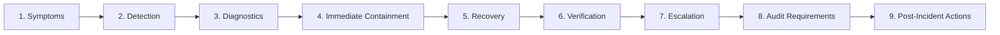

# Phase 1 — Operational Runbooks Architecture Specification

**Document Control Information**
- **Project Name:** SIH26100 — AI-Powered Integrated Bid Compliance Verification Platform for GeM Procurement
- **Organization:** Ministry of Petroleum & Natural Gas / CPCL
- **Document Version:** 1.0.0 (Phase 1 — Task 9 Operational Runbooks Specification)
- **Status:** DESIGN DRAFT / PENDING REVIEW
- **Security Classification:** INTERNAL
- **Mode:** DESIGN ONLY — ZERO CODE IMPLEMENTATION

---

## 1. Executive Summary & Purpose

This specification defines the operational runbook architecture for the SIH26100 platform. Operational runbooks provide step-by-step procedures for system administrators, DevOps leads, integration engineers, and security operations personnel to diagnose, contain, recover, and document operational failures and security incidents.

The core runbook principle is:
> **"Every production alert MUST link to a standardized Operational Runbook. Runbooks MUST specify clear containment, recovery, verification, and audit steps without containing raw passwords or environment secrets."**

---

## 2. Standardized Runbook Structure Template

Every runbook scenario follows a mandatory 9-step structure:

---

## 3. Master Catalog of Eighteen Operational Runbooks

The system specifies eighteen concrete operational runbook scenarios:

### Runbook RB-01: API Subsystem Outage (HTTP 5xx Spike)
- **Symptoms:** High HTTP 500/502 error rates, user browser error banners, API endpoint failures.
- **Detection:** `API_5XX_ERROR_SPIKE` Critical alert fires; Dashboard DB-03 shows red 5xx error rate spike.
- **Diagnostics:** Inspect API container stdout logs (`LogEvent` category: `OPERATIONAL`); check PostgreSQL pool status.
- **Immediate Containment:** Restart unhealthy API container pods; route traffic away from failing instance via load balancer.
- **Recovery:** Restore API process; confirm DB connection pool initialization.
- **Verification:** Execute readiness probe (`GET /api/v1/health/readiness`); confirm HTTP 200 responses on synthetic health endpoints.
- **Escalation:** Escalate to Application Lead if 5xx errors persist $> 15$ minutes.
- **Audit Requirements:** Log `INCIDENT_CONTAINMENT_EXECUTED` event in administrative audit ledger.
- **Post-Incident Actions:** Conduct post-incident review (PIR); update connection pool limits if pool exhaustion was root cause.

### Runbook RB-07: AI Provider Outage or Service Degradation
- **Symptoms:** High latency on extraction tasks, timeout errors on Pre-AI Privacy Gateway calls, 502/504 errors from cloud LLM API.
- **Detection:** `AI_PROVIDER_OUTAGE` Warning alert fires; Dashboard DB-06 shows LLM latency spike $> 10.0$s.
- **Diagnostics:** Check AI Gateway log events (`AITelemetryEvent`); verify cloud provider status page.
- **Immediate Containment:** Execute dynamic AI provider failover in AI Gateway config (`PRIMARY_CLOUD` $\rightarrow$ `SECONDARY_CLOUD` or `LOCAL_MODEL`).
- **Recovery:** AI Gateway automatically routes extraction prompts to secondary provider or local model.
- **Verification:** Submit test extraction prompt through synthetic test runner; verify JSON schema validation success.
- **Escalation:** Escalate to AI Engineering Lead if secondary provider also degrades.
- **Audit Requirements:** Record `AI_ROUTING_FALLBACK_EXECUTED` event capturing provider transition.
- **Post-Incident Actions:** Restore primary provider routing once cloud provider status returns to normal.

### Runbook RB-09: Government API Outage (MCA / GSTN Portal Down)
- **Symptoms:** High technical transport timeout rate (504 Timeout) on government adapter calls; verification tasks stalling.
- **Detection:** `GOVT_PORTAL_TIMEOUT_SPIKE` or `GOVT_CIRCUIT_BREAKER_OPEN` alert fires on Dashboard DB-07.
- **Diagnostics:** Check Government Gateway adapter logs (`GovtIntegrationTelemetryEvent`); inspect transport status codes.
- **Immediate Containment:** Circuit breaker trips to `OPEN`; switch target government adapter mode from `LIVE` to `MANUAL_FALLBACK`.
- **Recovery:** System automatically routes pending verifications to human officer manual review queue (`MANUAL_FALLBACK` mode). Bid compliance evaluations are NOT failed due to portal outage.
- **Verification:** Verify that manual fallback queue receives pending verification tasks; confirm zero false compliance `FAIL` outputs.
- **Escalation:** Notify Integration Engineering Lead and GeM Helpdesk.
- **Audit Requirements:** Record `GOVT_ADAPTER_MODE_SWITCHED` event in SHA-256 audit ledger.
- **Post-Incident Actions:** Monitor portal availability; restore adapter mode to `LIVE` once government API stabilizes.

### Runbook RB-13: SHA-256 Audit Chain Integrity Anomaly
- **Symptoms:** Daily audit verification job detects hash mismatch ($H_n \neq \text{SHA256}(H_{n-1} \parallel P_n)$); vigilance alert triggered.
- **Detection:** `AUDIT_HASH_CHAIN_MUTATED` Critical alert fires instantly; Dashboard DB-11 shows `CHAIN TAMPERED`.
- **Diagnostics:** Execute automated audit chain verification tool to identify exact block ULID where hash linkage diverges.
- **Immediate Containment:** **Lock write transactions** on affected audit table; take read-only cryptographic snapshot of raw PostgreSQL database.
- **Recovery:** Inspect database WAL logs to determine if divergence was caused by unauthorized DB modification or hardware bit-flip. Restore verified clean database snapshot if tampering confirmed.
- **Verification:** Re-run audit verification job; confirm 100% hash linkage continuity ($H_0 \rightarrow H_{\text{head}}$).
- **Escalation:** **Immediate mandatory escalation** to CISO, CPCL Lead Auditor, and Vigilance Department.
- **Audit Requirements:** Log forensic audit report detailing exact divergence ULID, timestamp, and restoration action.
- **Post-Incident Actions:** Conduct security incident forensics; audit DB user account access logs.

### Runbook RB-16: Malware Upload Event
- **Symptoms:** Ingestion scanner detects virus signature in uploaded bid document PDF/ZIP.
- **Detection:** `MALWARE_DETECTED_SEV1` Critical alert fires instantly; document flagged as `QUARANTINED`.
- **Diagnostics:** Inspect ClamAV scan log in Ingestion Quarantine Gateway (`DocSecurityLog`).
- **Immediate Containment:** File object is permanently locked inside `staging-quarantine/` bucket; promotion to primary storage (`tenders-valid/`) is blocked. Temporary scratch buffers purged.
- **Recovery:** System returns HTTP 400 Bad Request error to uploader (`DOCUMENT_MALWARE_REJECTED`); bid processing for affected file halted.
- **Verification:** Confirm object is isolated in quarantine bucket and zero secondary file access is permitted.
- **Escalation:** Escalate to Security Operations Lead.
- **Audit Requirements:** Record `MALWARE_INGESTION_BLOCKED` event in security audit log with file hash and uploader IP.
- **Post-Incident Actions:** Submit malware signature to central threat intelligence feed.

---

## 4. Runbook Summary Matrix for 18 Scenarios

| Runbook ID | Scenario Title | Severity Tier | Primary Recovery Action | Required Escalation |
|---|---|---|---|---|
| **RB-01** | API Subsystem Outage | Critical | Restart API containers; balance load | Application Lead |
| **RB-02** | Database Degradation | Critical | Scale DB pool; kill slow queries | Database Admin |
| **RB-03** | Redis Broker Outage | Critical | Restart Redis container; verify network | Infrastructure Lead |
| **RB-04** | Celery Worker Backlog | Warning | Autoscale background worker pool | Operations Lead |
| **RB-05** | Document Processing Failure | Warning | Isolate malformed PDF; trigger CDR | Systems Engineer |
| **RB-06** | OCR Engine Degradation | Warning | Restart OCR container; cap RAM | Systems Engineer |
| **RB-07** | AI Provider Outage | Warning | Switch to secondary LLM / local model | AI Engineering |
| **RB-08** | AI Quality Degradation | Warning | Update prompt template; check schema | AI Engineering |
| **RB-09** | Govt API Outage | Warning | Switch adapter to `MANUAL_FALLBACK` | Integration Lead |
| **RB-10** | Govt Auth Failure | Critical | Re-inject credentials from Key Vault | Integration Lead |
| **RB-11** | Govt Rate Limiting | Warning | Throttling outbound adapter rate | Integration Lead |
| **RB-12** | Compliance Engine Failure | Critical | Restart AST engine; check policy bind | Compliance Lead |
| **RB-13** | Audit Chain Anomaly | Critical | Lock DB writes; snapshot; restore | CISO / Vigilance |
| **RB-14** | Object Storage Failure | Critical | Failover MinIO node; verify SSE-S3 | Infrastructure Lead |
| **RB-15** | Security Incident (Auth) | Critical | Revoke JWT token; lock user session | Security Ops |
| **RB-16** | Malware Upload Event | Critical | Lock file in quarantine; purge scratch | Security Ops |
| **RB-17** | Prompt Injection Event | Warning | Tag doc high risk; route to human review | AI Security Lead |
| **RB-18** | Human Review Backlog | Warning | Reassign review queue; notify Manager | Department Head |
