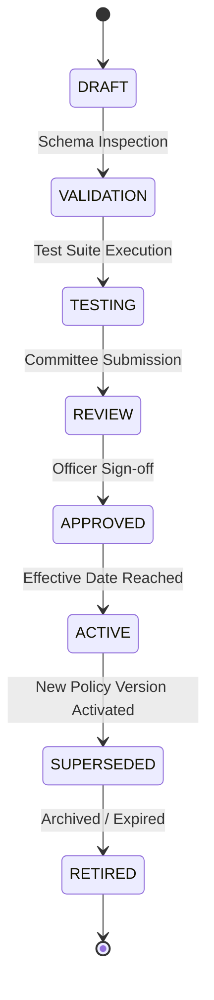

# Phase 1 — Policy Versioning & Change Management Specification

## Overview

The **Policy Versioning Architecture** defines how regulatory guidelines, gazette notifications, departmental procurement orders, and local content policies are represented, versioned, and bound to compliance evaluations in the **SIH26100 Bid Compliance Verification Platform**.

This architecture guarantees that legal policy parameters (e.g., Public Procurement Policy for MSEs Order, Public Procurement Preference to Make in India Order) are **never hardcoded in application source code**, but managed as versioned, auditable domain objects.

---

## 1. Zero Hardcoded Policy Rule

> [!IMPORTANT]
> **NO HARDCODED PROCUREMENT NUMBERS IN CODE:**
> Numeric thresholds (e.g., 50% Class-I local content minimum, 20% Class-II local content minimum, ₹10 Crore turnover thresholds, 10-year startup eligibility limits) must **NEVER** be hardcoded inside Python scripts, rule evaluator code, or API handlers.
> All operational thresholds are defined as attributes within version-controlled `PolicyVersion` database objects and passed dynamically into rule condition ASTs.

---

## 2. `PolicyVersion` Entity Schema

Reusing the `PolicyVersion` domain entity from Phase 1 Task 2:

| Field Name | Type | Description & Constraints |
| :--- | :--- | :--- |
| `policy_version_id` | ULID String | Primary Key identifier. |
| `policy_code` | String | Functional policy code (e.g., `"POL-MII-LOCAL-CONTENT"`). |
| `version` | String | SemVer string (e.g., `"v2026.1.0"`). |
| `title` | String | Official display title (e.g., `"Public Procurement (Preference to Make in India) Order 2026"`). |
| `issuing_authority` | String | Ministry or department (e.g., `"Department for Promotion of Industry and Internal Trade (DPIIT)"`). |
| `source_gazette_reference`| String | Official gazette notification reference number or URL. |
| `effective_from` | Timestamp | ISO 8601 UTC timestamp marking activation. |
| `effective_until` | Timestamp | Optional ISO 8601 UTC timestamp marking expiry/supersession. |
| `policy_parameters` | JSONB Map | Key-value store of threshold variables (e.g., `{"class1_min_local_content": 50, "class2_min_local_content": 20}`). |
| `approval_state` | Enum | Governance state (`APPROVED`, `ACTIVE`, `SUPERSEDED`, etc.). |
| `supersedes_policy_version_id`| ULID String | Reference to preceding `PolicyVersion` ID. |
| `created_by_user_id` | ULID String | User ID of policy author/administrator. |
| `created_at` | Timestamp | Creation timestamp. |

---

## 3. Policy Lifecycle State Machine

Policies transition through an explicit governance lifecycle:



### 3.1 Policy Lifecycle Descriptions
1. **`DRAFT`:** Policy parameter definitions constructed by policy administrators.
2. **`VALIDATION`:** Automated verification of rule references and schema integrity.
3. **`TESTING`:** Synthetic test suite run to evaluate policy impact on sample tenders.
4. **`REVIEW`:** Submitted to CPCL Procurement Committee for official review.
5. **`APPROVED`:** Formally approved; waiting for `effective_from` timestamp.
6. **`ACTIVE`:** Currently enforced policy version for active tender evaluations.
7. **`SUPERSEDED`:** Replaced by a newer policy version; retained permanently for historical evaluation reproducibility.
8. **`RETIRED`:** Formally revoked policy version; retained for long-term legal archives.

---

## 4. Tender & Policy Version Selection Architecture

Applicable tender requirements and policies are selected using the tender's version lifecycle and effective applicability rules, considering as applicable:
* **Selection Factors:** `TenderVersion`, published corrigenda/amendments, effective dates/times, publication/effective lifecycle, submission closing timeline, applicability to the particular bid submission, and relevant procurement policy/rule versions.

$$\text{ActivePolicy} = \text{Select PolicyVersion WHERE } \text{policy\_code} = P \text{ AND } \text{effective\_from} \le t_{\text{effective}} < \text{effective\_until}$$

```
                                [Tender Submission Evaluation]
                                              │
                                              ▼
┌────────────────────────────────────────────────────────────────────────────────────────┐
│ Resolve Applicable TenderVersion & PolicyVersion Set                                   │
├────────────────────────────────────────────────────────────────────────────────────────┤
│ • Bound to applicable TenderVersion, Corrigenda, and PolicyVersion at t_effective.     │
│ • Preserves (1) exact TenderVersion, (2) Corrigenda, (3) Effective Timestamps,         │
│   (4) Policy/Rule Versions, and (5) Selection Basis Reason.                            │
│ • If a new PolicyVersion is published later, EXISTING tender evaluations retain       │
│   their original bound policy anchor.                                                  │
└────────────────────────────────────────────────────────────────────────────────────────┘
```

> [!CAUTION]
> **NO RETROACTIVE POLICY MUTATION:** A policy update published on Date $T_2$ **never retroactively modifies** evaluations performed for tenders bound to Date $T_1$. Historical evaluation snapshots remain permanently bound to the exact set of tender and policy versions applicable to that submission, with the selection basis preserved.

