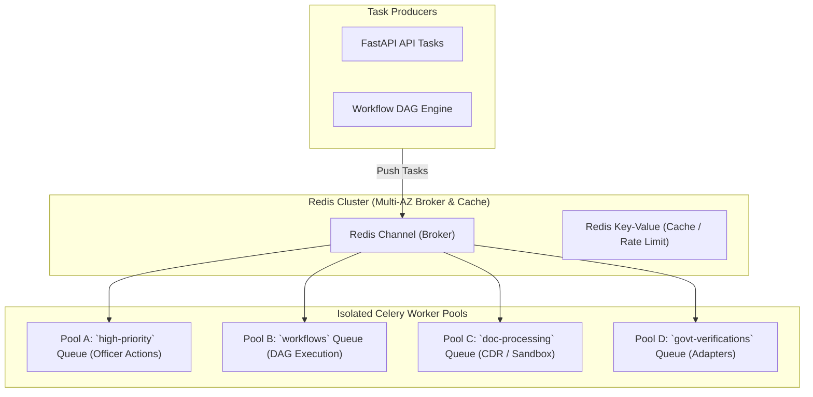

# Phase 1 — Redis & Celery Deployment Architecture Specification

**Document Control Information**
- **Project Name:** SIH26100 — AI-Powered Integrated Bid Compliance Verification Platform for GeM Procurement
- **Organization:** Ministry of Petroleum & Natural Gas / CPCL
- **Document Version:** 1.0.0 (Phase 1 — Task 10 Redis/Celery Specification)
- **Status:** DESIGN DRAFT / PENDING REVIEW
- **Security Classification:** INTERNAL
- **Mode:** DESIGN ONLY — ZERO CODE IMPLEMENTATION

---

## 1. Executive Summary & Purpose

This specification defines the deployment architecture for Redis (broker and cache) and Celery background workers (DAG orchestration, document processing, AI gateway calls, government verification).

The worker deployment architecture respects Task 7:
> **"Celery workers enforce at-least-once task delivery, 4-tier idempotency keys, TaskAttempt retries, and graceful two-phase cancellation without altering task execution semantics."**

---

## 2. Redis & Celery Topology

---

## 3. Dedicated Queue & Worker Pool Specifications

| Queue Name | Primary Workload Characteristics | Target Concurrency | Prefetch Multiplier | Isolation Control |
|---|---|---|---|---|
| **`high-priority`** | Officer workbench actions, manual override approvals | 8 Workers | `prefetch_multiplier = 1` | High responsiveness; unblocked by background batch jobs |
| **`workflows`** | Core DAG state transitions, AST rule evaluation | 16 Workers | `prefetch_multiplier = 2` | Standard worker pool with auto-scaling |
| **`doc-processing`**| PDF disarming, OCR text extraction, malware scan | 12 Workers | `prefetch_multiplier = 1` | Sandbox container isolation, restricted memory, 180s timeout |
| **`govt-verifications`**| External registry adapter verification requests | 8 Workers | `prefetch_multiplier = 1` | Outbound rate-limiting, circuit breaker handling |

---

## 4. Redis Hardening & Resilience

1. **Transit & Rest Encryption:** Redis connections require TLS (`rediss://`); storage persistence uses KMS encryption.
2. **Authentication Protection:** Access requires strong Redis AUTH tokens stored in Secrets Manager.
3. **Queue Persistence & Backup:** Redis snapshots execute automated hourly RDB persistence backups to prevent task state loss during container restarts.

---

## 5. Logical Isolation & Availability Model

1. **Workload Isolation:** Logical isolation of task brokerage, idempotency/cache functions, rate limiting, and other workloads SHALL use dedicated Redis deployments, logical isolation, namespaces/keyspaces, or equivalent mechanisms according to operational and security requirements. Unnecessary coupling between telemetry and task processing is explicitly avoided.
2. **High Availability Model:** Redis deployment uses an availability architecture appropriate to the selected Redis-compatible service, including multi-AZ/failover capabilities where supported and required.
3. **Preserved Task 7 Semantics:** Celery worker task execution preserves at-least-once delivery, `TaskAttempt` tracking, idempotency keys, retries, and cancellation protocols.
