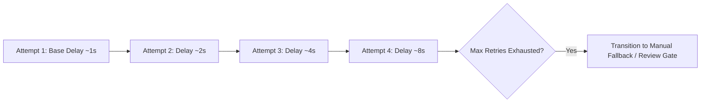

# Phase 1 — Fault Classification, Retry Backoff & Resilience Architecture

## Overview

The **Fault Classification, Retry Backoff & Resilience Architecture** defines how technical errors, worker crashes, network timeouts, upstream portal outages, and data discrepancies are detected, classified, retried, or recovered within the **SIH26100 Bid Compliance Verification Platform**.

This architecture guarantees that technical execution failures **NEVER** trigger automated bidder disqualification or pass/fail compliance corruption.

---

## 1. Four-Tier Fault Taxonomy

When an error occurs during workflow execution, the orchestrator interceptor inspects the exception and classifies it into one of four distinct fault categories:

```
[Execution Failure Exception] ──► [Fault Classification Interceptor]
                                                  │
       ┌───────────────────┬──────────────────────┼──────────────────────┐
       ▼                   ▼                      ▼                      ▼
[Tier A: Transient]   [Tier B: Permanent]   [Tier C: Govt Business]  [Tier D: Review Gate]
(Network / Timeout)   (Schema / Format)     (Not Found / Inactive) (Ambiguity / Stale)
       │                   │                      │                      │
       ▼                   ▼                      ▼                      ▼
[Exponential Retry]   [Fail Task / Alert]   [Record Business Fact] [Pause for Officer]
```

### Tier A: Transient Technical Failures
* **Examples:** Network socket timeouts, HTTP 502/503/504 gateway errors, temporary DB connection pool exhaustion, Celery worker SIGKILL.
* **Orchestration Behavior:** Automatically retry using exponential backoff with full jitter. Does **not** alter business compliance state.

### Tier B: Permanent Technical Failures
* **Examples:** Corrupted PDF payload, malformed JSON schema, unparseable document binary, unsupported language encoding.
* **Orchestration Behavior:** Mark task `FAILED`. Trigger admin alert. Transition workflow stage to `PARTIAL` or route to `REQUIRES_HUMAN_REVIEW` for document re-upload request.

### Tier C: Government Business Verification Outcomes
* **Examples:** GSTIN record return `INACTIVE`, Udyam registration `CANCELLED`, PAN `NOT_FOUND`, CIN name mismatch.
* **Orchestration Behavior:** This is **NOT** a technical failure. Record normalized business verification result (`NOT_VERIFIED` / `MISMATCH`) and pass to Evidence Assembly (Task 5 & 6).

### Tier D: Human Review & Ambiguity Conditions
* **Examples:** Contradictory document facts, ambiguous identity match string score, missing mandatory evidence item.
* **Orchestration Behavior:** Pause workflow at checkpoint and transition workflow execution state to `WAITING` (`REQUIRES_HUMAN_REVIEW`).

---

## 2. Exponential Backoff & Jitter Algorithm

Transient technical retries (Tier A) calculate sleep delays using Exponential Backoff with Equal Jitter to prevent retry storms against upstream services:

$$t_{\text{sleep}} = \frac{t_{\text{temp}}}{2} + \text{Random}\left(0, \, \frac{t_{\text{temp}}}{2}\right)$$

Where:
$$t_{\text{temp}} = \min\left(t_{\text{max\_backoff}}, \, t_{\text{base}} \times 2^{\text{attempt}}\right)$$



### 2.1 Default Retry Parameters (Deployment-Configurable)
* **Base Backoff ($t_{\text{base}}$):** 1000 ms (configurable default).
* **Maximum Backoff ($t_{\text{max\_backoff}}$):** 16,000 ms (configurable default).
* **Maximum Automatic Attempts:** 3 retries (configurable default per task type).

---

## 3. Dead-Letter Handling & Task Recovery Matrix

| Task Type | Fault Category | Max Retries | Fallback / Recovery Mechanism | Final Workflow State |
| :--- | :--- | :--- | :--- | :--- |
| **`TASK_FETCH_GSTIN`** | Tier A (Timeout/503) | 3 | Activate `MANUAL_FALLBACK` government adapter. | `PARTIAL` $\rightarrow$ `WAITING` |
| **`TASK_FETCH_GSTIN`** | Tier C (Inactive GST) | 0 (Business Result) | Record `gstin_status = Inactive`; pass to Rules Engine. | `RUNNING` $\rightarrow$ Rules Engine |
| **`TASK_EXTRACT_PDF`** | Tier B (Corrupt PDF) | 0 (Permanent) | Flag `CORRUPT_DOCUMENT`; prompt officer for re-upload. | `WAITING` (`REQUIRES_HUMAN_REVIEW`) |
| **`TASK_EVAL_RULES`** | Tier B (Invalid AST) | 0 (Permanent) | Reject rule execution; log `RULE_PARSING_ERROR`. | `FAILED` (System Error) |
| **`TASK_AI_LAYOUT`** | Tier A (Worker Crash) | 3 | Re-queue task on alternate AI worker node. | `RUNNING` |

---

## 4. Manual Retry & Checkpoint Recovery

When a workflow task transitions to `PARTIAL` or `FAILED` due to transient infrastructural issues:

1. **Checkpoint Preservation:** The orchestrator preserves all previously completed task outputs (`NormalizedFact` entries, `EvidenceRecord` hashes) in PostgreSQL.
2. **Authorized Manual Retry:** Procurement Officers or System Administrators can trigger a manual retry via `POST /api/v1/workflows/{id}/retry`.
3. **Selective Task Execution:** The orchestrator evaluates the DAG, skips already-completed nodes, and resumes execution strictly from the failed checkpoint node.
