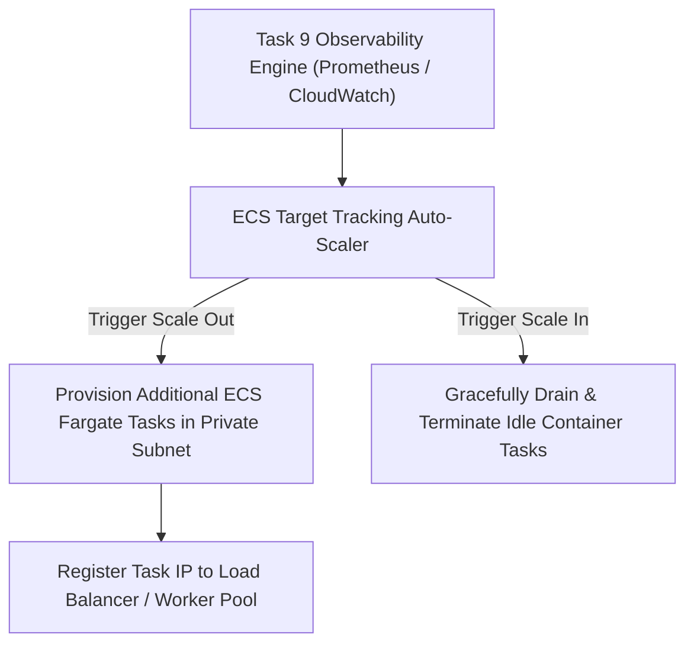

# Phase 1 — Scaling & Elasticity Architecture Specification

**Document Control Information**
- **Project Name:** SIH26100 — AI-Powered Integrated Bid Compliance Verification Platform for GeM Procurement
- **Organization:** Ministry of Petroleum & Natural Gas / CPCL
- **Document Version:** 1.0.0 (Phase 1 — Task 10 Scaling Specification)
- **Status:** DESIGN DRAFT / PENDING REVIEW
- **Security Classification:** INTERNAL
- **Mode:** DESIGN ONLY — ZERO CODE IMPLEMENTATION

---

## 1. Executive Summary & Purpose

This specification defines horizontal and vertical auto-scaling rules, scaling triggers, and capacity management bounds across platform components.

---

## 2. Horizontal Auto-Scaling Policy Matrix

| System Workload | Primary Scaling Metric | Scale-Out Threshold | Scale-In Threshold | Scale Bounds | Cooldown Period |
|---|---|---|---|---|---|
| **FastAPI Backend API** | Average CPU Utilization / Request Rate | CPU $> 70\%$ for 3 min OR RPS $> 500$ | CPU $< 30\%$ for 10 min | Min 2 / Max 10 Tasks | 180 Seconds |
| **Next.js Frontend UI** | Average Memory Utilization | RAM $> 75\%$ for 5 min | RAM $< 35\%$ for 15 min | Min 2 / Max 6 Tasks | 300 Seconds |
| **Celery Core Workers** | Redis Queue Depth (`celery`) | Queue Depth $> 200$ tasks for 3 min | Queue Depth $< 20$ tasks for 10 min | Min 2 / Max 8 Tasks | 120 Seconds |
| **Celery OCR Workers** | Document Queue Backlog (`ocr`) | Queue Backlog $> 50$ docs for 2 min | Queue Backlog $< 5$ docs for 10 min | Min 2 / Max 12 Tasks | 120 Seconds |

---

## 3. Scaling Feedback Topology

