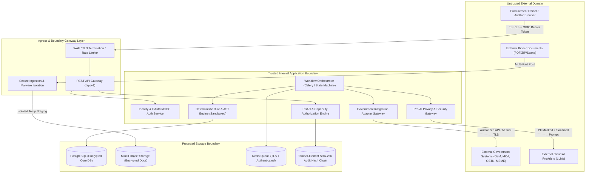

# Phase 1 — Security Architecture Specification
## Unified Security, Privacy, Threat-Modeling & Trust Architecture

**Document Control Information**
- **Project Name:** SIH26100 — AI-Powered Integrated Bid Compliance Verification Platform for GeM Procurement
- **Organization:** Ministry of Petroleum & Natural Gas / CPCL (Chennai Petroleum Corporation Limited)
- **Document Version:** 1.0.0 (Phase 1 — Task 8 Security Architecture Baseline)
- **Status:** DESIGN DRAFT / PENDING REVIEW
- **Security Classification:** INTERNAL
- **Mode:** DESIGN ONLY — ZERO CODE IMPLEMENTATION

---

## 1. Executive Summary & Purpose

### 1.1 Purpose
This document establishes the overarching security, privacy, threat-modeling, and trust architecture for the SIH26100 Bid Compliance Verification Platform. It synthesizes and unifies the security controls across all preceding system layers established in Tasks 1–7 (System Boundaries, Data Modeling, API Contracts, AI Pipeline, Government Integration, Compliance Engine, and Workflow Orchestration).

The core security objective of the platform is:
> **"Protect procurement data, bidder information, government verification data, AI processing, evidence, workflow execution, audit history, and human decisions throughout the complete system lifecycle."**

### 1.2 Multi-Dimensional Security Spectrum
The architecture provides defense-in-depth across seven foundational security dimensions:
1. **Confidentiality:** Protection of sensitive tender criteria, commercial bidder documents, financial metrics, and PII against unauthorized disclosure.
2. **Integrity:** Assurance that bid documents, extracted facts, rule expressions, evaluation traces, and decision records cannot be altered or corrupted without detection.
3. **Availability:** Resilience of evaluation pipelines, API gateways, queues, and document stores against thundering herd retries, resource exhaustion, and denial of service.
4. **Authenticity:** Verification of human identity (Procurement Officers, Reviewers, Auditors) and machine identities (API services, background workers, adapters).
5. **Accountability:** Unambiguous attribution of every system state change, manual override, policy update, and evaluation execution to an identified human officer or system service.
6. **Privacy:** Data minimization, pre-AI redaction, purpose limitation, and policy-controlled retention designed to support privacy obligations and applicable data protection requirements.
7. **Non-Repudiation / Auditability:** Tamper-evident record-keeping linking every outcome to immutable evidence artifacts and SHA-256 hash-chained audit lineages.

---

## 2. Core Security Architecture Principles

The security architecture is governed by fifteen core principles designed to enforce defense-in-depth across all system boundaries:

| # | Security Principle | Architectural Application |
|---|---|---|
| 1 | **Defense-in-Depth** | Security controls are applied at multiple nested layers: Network $\rightarrow$ Gateway $\rightarrow$ Service $\rightarrow$ Data Field $\rightarrow$ Storage. No single control failure compromises system security. |
| 2 | **Least Privilege** | Users, services, workers, and adapters are granted only the minimum permissions required to perform their explicit function. |
| 3 | **Deny by Default** | All API endpoints, resource routes, document accesses, and workflow transitions reject access unless an explicit authorization policy evaluates to true. |
| 4 | **Explicit Authorization** | Authorization decisions evaluate identity, role, action, target resource, procurement context, and data classification. |
| 5 | **Separation of Duties** | Administrative functions, evaluation executions, policy changes, and human approval overrides are isolated across distinct operational roles. |
| 6 | **Applicable Zero-Trust Principles** | Trust is never inferred from network position. Every request across system boundaries (API to Service, Service to DB, Gateway to External Provider) is explicitly authenticated and authorized. |
| 7 | **Secure by Design** | Security controls (input validation, rate limiting, encryption, PII masking) are integral architecture primitives, not add-on modules. |
| 8 | **Privacy by Design & Data Minimization** | Unnecessary PII and sensitive bidder fields are scrubbed or redacted before secondary processing (e.g., LLM prompt construction). |
| 9 | **Secure Failure** | Subsystem failures (authentication timeout, adapter failure, AI validation error) default to safe, locked-down states rather than exposing raw data or skipping safety checks. |
| 10 | **Complete Mediation** | Every access attempt to every document, fact, rule, or evaluation snapshot must pass through authorization mediation. No cached session bypasses checks. |
| 11 | **Tamper-Evident Audit** | Audit logs are structured as SHA-256 hash-chained ledgers where any retroactive alteration invalidates forward hash linkages. |
| 12 | **Traceability & Lineage** | Every normalized fact and compliance result traces backward through an immutable chain to raw source documents or authorized government verification attempts. |
| 13 | **Compartmentalization** | Background workers, OCR engines, AST parsers, and external adapters execute in isolated execution boundaries to contain potential compromises. |
| 14 | **Explicit Trust Boundaries** | Clear, unambiguous interfaces separate trusted internal core domains from semi-trusted intermediaries and completely untrusted external inputs. |
| 15 | **Non-Authoritative AI Boundary** | Artificial Intelligence is strictly restricted to extraction, formatting, and explanation assistance. Final evaluation rules and qualification decisions remain 100% deterministic and human-governed. |

---

## 3. High-Level Security Architecture Overview

---

## 4. Subsystem Security Architecture Summary

### 4.1 Ingestion & Document Security
- **Untrusted Input Assumption:** All uploaded bid documents, PDFs, zip archives, and image scans are treated as untrusted, potentially malicious content.
- **Multi-Stage Processing Isolation:** Documents pass through file signature validation, MIME matching, malware scanning, structural decompression bomb checks, and parser sandboxing before storage.
- **Quarantine Lifecycle:** Documents failing ingestion checks are flagged, quarantined in isolated storage paths, and prevented from entering the AI extraction pipeline.

### 4.2 Pre-AI Privacy Gateway & Model Security
- **Sensitive Data Isolation:** Direct transmission of unredacted PII or sensitive bidder credentials (such as PAN, personal phone numbers, or detailed financial account numbers) to external cloud LLMs is prohibited by default.
- **Privacy Gateway Filtering:** All textual inputs routed to external LLM providers pass through the Pre-AI Privacy Gateway for entity detection, tokenization, masking, or local model execution based on tender sensitivity classification.
- **Non-Authoritative Boundary:** AI models cannot execute rule logic, modify compliance statuses (`PASS`/`FAIL`), invoke government APIs directly, or override human officer decisions.

### 4.3 Deterministic Rule Engine AST Security
- **Zero Execution Sandbox:** Rule evaluation executes exclusively through non-executable AST tree traversals in Python/Pydantic.
- **Prohibited Primitives:** Native dynamic evaluation primitives (`eval()`, `exec()`, `__import__`, string reflections) are strictly prohibited in the rule engine design.
- **Bounded Resource Evaluation:** Expression evaluations are constrained by bounded node depth and iteration caps to prevent algorithmic complexity or DoS attacks during rule evaluation.

### 4.4 Government Integration Security Boundary
- **Authorized Source Principle:** Government verification responses are accepted only from pre-registered, authenticated government system endpoints (or authorized manual officer fallbacks).
- **Quad-Operating Mode Security:** Adapter operations run under four distinct security modes (`LIVE`, `SANDBOX`, `MOCK`, `MANUAL_FALLBACK`). Sensitive production credentials are loaded only in `LIVE` mode and isolated per government agency.
- **Status Separation:** Technical transport failures (`502 Bad Gateway`, `504 Gateway Timeout`) are isolated from business status verification results (`VERIFIED`, `UNMATCHED`, `NOT_FOUND`) to prevent technical glitches from corrupting bidder compliance evaluations.

### 4.5 Workflow & Job Queue Isolation
- **Idempotent Queue Handlers:** Async jobs enforce 4-tier idempotency keys (`API`, `WorkflowInstance`, `Task`, `GovtVerification`) to prevent duplicate execution vulnerabilities.
- **Two-Phase Graceful Cancellation:** Workflow termination transitions state from `CANCEL_REQUESTED` to `CANCELLED`, allowing workers to release database locks and persist partial state cleanly without audit corruption.
- **Task Payload Minimization:** Celery/Redis queue messages carry minimum ULID references and context tokens rather than raw document contents or sensitive bidder payloads.

### 4.6 Tamper-Evident Audit & Storage Security
- **SHA-256 Hash Chain:** Audit events (`AuditEvent`) are immutable records linked sequentially via cryptographic hash chains ($H_n = \text{SHA256}(H_{n-1} \parallel \text{Payload}_n)$). Any attempt to alter historical audit records invalidates the hash chain sequence.
- **Encryption at Rest & Transit:** All database tables, object storage buckets, Redis channels, and external API requests enforce industry-standard encryption protocols (TLS 1.3 in transit, AES-256-GCM at rest for sensitive fields).

---

## 5. Defense-in-Depth Control Matrix

| System Layer | Primary Threat | Architectural Control | Verification / Compliance Mechanism |
|---|---|---|---|
| **Client / Presentation** | Session Hijacking, CSRF, XSS | Short-lived OAuth2 tokens, HttpOnly/SameSite cookies, strict Content Security Policy (CSP), OWASP-aligned header defaults. | Security headers audit, token validation middleware tests. |
| **API Gateway** | DoS, Rate Limit Abuse, Bypassed Auth | API Gateway rate-limiting buckets, IP throttling, OAuth2 JWT validation middleware, RFC 7807 error sanitization. | Automated gateway security tests, rate limit verification. |
| **Application / Workflow** | Privilege Escalation, State Corruption | Fine-grained RBAC + Capability authorization matrix, two-phase cancellation, state machine transition validation. | State machine transition matrix tests, capability isolation audits. |
| **AI Gateway** | Prompt Injection, Data Exfiltration | Pre-AI Privacy Gateway entity scrubbing, schema-enforced JSON output validation, prompt injection input filters. | AI safety benchmark suite, prompt injection regression suites. |
| **Government Adapters** | Credential Exposure, Thundering Herd | Scoped secret isolation, circuit breaker pattern, exponential backoff backoff jitter, transport status separation. | Resilience tests, adapter mode validation, credential isolation audits. |
| **Rule Engine** | Dynamic Code Injection, Unbounded Loops | Safe AST expression parser, zero `eval()`/`exec()`, dynamic policy binding, deterministic validation. | AST invariant tests, property-based evaluation benchmarks. |
| **Storage / Audit** | Data Tampering, Unauthorized Data Access | SHA-256 hash-chained audit ledger, AES-256-GCM field encryption, private MinIO buckets, TLS Redis auth. | Hash-chain integrity verifiers, encryption-at-rest checks. |

---

## 6. Relationship to Tasks 1–7 Frozen Baseline

This security architecture strictly respects and builds upon the frozen baseline established in Tasks 1–7:
- **Task 1 (System Architecture):** Preserves Modular Monolith architecture, boundaries, and tamper-evident SHA-256 audit concept.
- **Task 2 (Data Architecture):** Preserves security classifications (`PUBLIC`, `INTERNAL`, `CONFIDENTIAL`, `RESTRICTED`, `PII`), AES-256-GCM field protection, ULID/UUIDv4 dual-ID strategy, and policy-controlled retention.
- **Task 3 (API Architecture):** Preserves REST `/api/v1` conventions, RFC 7807 error structures, rate-limiting rules, and authorization matrix.
- **Task 4 (AI Architecture):** Preserves Non-Authoritative AI Axiom, provider abstraction layer, prompt safety sandboxing, and Pre-AI privacy routing.
- **Task 5 (Government Integration):** Preserves Quad-Operating Modes, authorized sources rule, technical vs business status separation, and manual fallback workflow.
- **Task 6 (Compliance Engine):** Preserves AST sandboxing, policy version dynamic binding, status separation (`MISSING` $\neq$ `FAIL`), and human override non-mutating governance.
- **Task 7 (Workflow Orchestration):** Preserves multi-dimensional state machine isolation, 4-tier idempotency, 2-phase cancellation, and workflow event lineage audit linking.

---

## 7. Out-of-Scope & Future Implementation Notes

- **Implementation Code:** Zero application code (FastAPI routes, SQLAlchemy ORMs, Celery tasks, Docker compose files) is included in Task 8.
- **Live Credentials & Keys:** No production secrets, cloud API keys, private certificates, or real database passwords are included or generated.
- **External Certifications:** This document specifies architectural controls designed to support compliance and security alignment; formal third-party audits (e.g., STQC, ISO 27001, CERT-In) represent future operational milestones.
