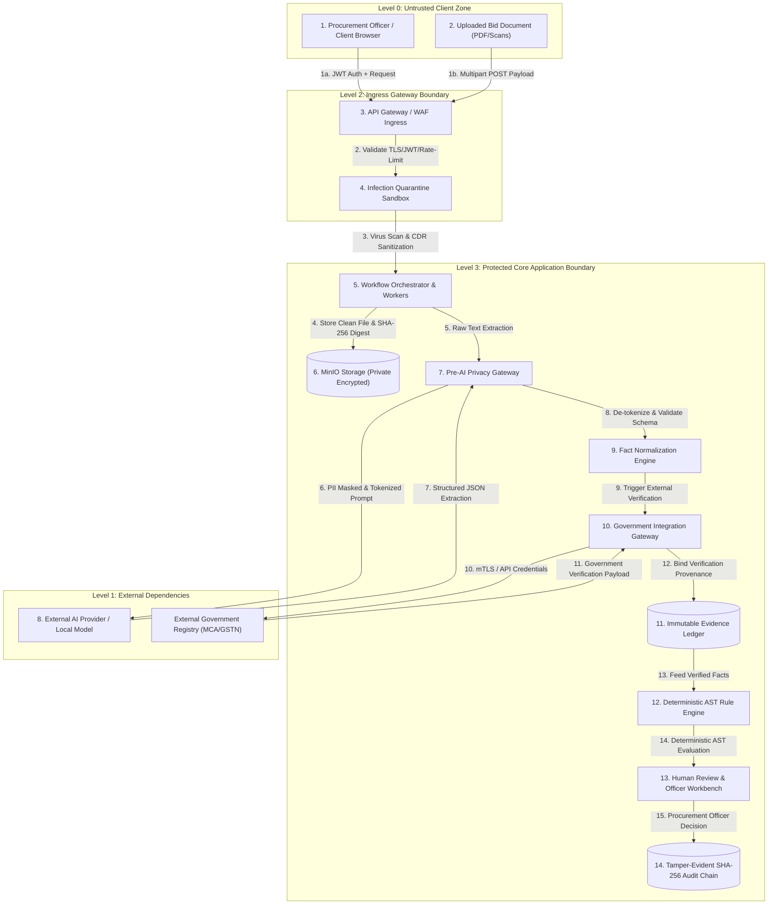
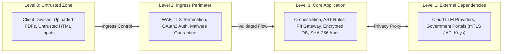

# Phase 1 — Threat-Aware End-to-End Data Flow Specification

**Document Control Information**
- **Project Name:** SIH26100 — AI-Powered Integrated Bid Compliance Verification Platform for GeM Procurement
- **Organization:** Ministry of Petroleum & Natural Gas / CPCL
- **Document Version:** 1.0.0 (Phase 1 — Task 8 Security Data Flow Specification)
- **Status:** DESIGN DRAFT / PENDING REVIEW
- **Security Classification:** INTERNAL
- **Mode:** DESIGN ONLY — ZERO CODE IMPLEMENTATION

---

## 1. Executive Summary & Purpose

This specification documents the threat-aware end-to-end data flow for the SIH26100 platform. It traces data movement across fourteen complete processing steps—from initial user submission through document ingestion, AI extraction, government verification, rule evaluation, human governance, and tamper-evident audit logging.

The governing data flow principle is:
> **"Every data transition across subsystem boundaries enforces explicit security controls, threat mitigations, and audit logging to guarantee data integrity, privacy, and non-repudiation throughout the complete evaluation lifecycle."**

---

## 2. Threat-Aware Data Flow Diagram

---

## 3. Step-by-Step Security Control & Threat Mitigation Trace

The table below documents the security controls, trust boundaries crossed, threat mitigations, and audit logs recorded across all fourteen execution steps:

| Step # | Flow Step Name | Trust Boundary Crossing | Threats Mitigated | Primary Security Controls Applied | Audit Event Recorded |
|---|---|---|---|---|---|
| **1** | **User Request & Upload** | Level 0 Client $\rightarrow$ Level 2 Ingress Gateway | Session Hijacking, DoS, Malformed Request | TLS 1.3 encryption, OAuth2 JWT token validation, rate-limiting leaky bucket, OpenAPI schema check. | `API_REQUEST_RECEIVED` |
| **2** | **Ingress & Rate Throttling** | Level 2 Gateway Boundary | Thundering Herd, IP Flooding | WAF IP throttling, `X-Idempotency-Key` validation, size limit checks. | `RATE_LIMIT_EVALUATED` |
| **3** | **Quarantine Ingestion** | Level 2 Gateway $\rightarrow$ Quarantine Sandbox | Malware, Executable Macros, Zip Bombs | File magic byte check, ClamAV container scan, uncompressed size ratio limits (10:1 ratio limit). | `DOC_QUARANTINE_SCANNED` |
| **4** | **Document Storage & Hashing**| Level 2 Quarantine $\rightarrow$ Level 3 Storage | Storage Tampering, Public Access Leakage | CDR metadata disarming, SHA-256 digest calculation ($H_{\text{doc}}$), private MinIO SSE-S3 storage. | `DOC_DISARMED_STORED` |
| **5** | **Workflow Job Scheduling** | Level 3 Application Core Internal | Queue Poisoning, Race Conditions | Async Celery job creation, 4-tier idempotency key verification, payload ULID minimization. | `WFR_TASK_SCHEDULED` |
| **6** | **Pre-AI Privacy Scrubbing** | Level 3 Core Internal | PII Exposure, Sensitive Data Exfiltration | Automated regex & NLP PII detection, entity tokenization (`[PII_TOKEN_1]`), sanitized prompt construction. | `PRE_AI_PII_SCRUBBED` |
| **7** | **AI Structured Extraction** | Level 3 Core $\rightarrow$ Level 1 External AI | Direct/Indirect Prompt Injection, Context Poisoning | System prompt isolation, text tagged as `untrusted_content_source`, vendor zero data retention contract. | `AI_PROMPT_TRANSMITTED` |
| **8** | **AI Response Validation** | Level 1 External AI $\rightarrow$ Level 3 Core | Schema Manipulation, Hallucination | Rigid Pydantic JSON Schema validation (`extra = "forbid"`), output de-tokenization. | `AI_RESPONSE_VALIDATED` |
| **9** | **Fact Normalization** | Level 3 Core Internal | Unverified Claims, Evidence Fabrication | Automated evidence citation grounding check (verifying page # and snippet against raw text index). | `FACT_NORMALIZED` |
| **10** | **Government Verification** | Level 3 Core $\rightarrow$ Level 1 Govt Portal | Credential Leakage, Fake Verification API | Isolated Key Vault credentials, mTLS transport, Authorized Source Registry check, Quad-Operating Modes. | `GOVT_VERIFY_REQUESTED` |
| **11** | **Evidence Binding** | Level 1 Govt Portal $\rightarrow$ Level 3 Evidence | Status Separation Corruption | Binds normalized fact to `EvidenceRecord`, separates transport failure from business result (`UNMATCHED`). | `EVIDENCE_BOUND` |
| **12** | **Deterministic Rule Evaluation**| Level 3 Core Internal | Code Injection, Dynamic Execution Vulnerability | Non-executable AST tree traversal in Python/Pydantic, zero `eval()`/`exec()`, dynamic policy binding. | `RULE_EVAL_COMPLETED` |
| **13** | **Human Review & Governance** | Level 3 Core $\rightarrow$ Level 0 Presentation | Insider Collusion, Un-attributed Override | Officer Workbench presentation, mandatory `OfficerDecision` recording, policy-controlled four-eyes signoff. | `HUMAN_DECISION_RECORDED` |
| **14** | **Tamper-Evident Audit Ledger**| Level 3 Core $\rightarrow$ Level 3 Audit Storage | Audit Record Tampering, Repudiation | Append-only database user, SHA-256 hash-chain linkage ($H_n = \text{SHA256}(H_{n-1} \parallel P_n)$). | `AUDIT_EVENT_CHAINED` |

---

## 4. End-to-End Security Boundary Summary Matrix

---

## 5. Security Failure Mode Handling Summary

| Subsystem Data Step | Potential Security Failure | System Failure Reaction | Business Outcome |
|---|---|---|---|
| **Step 1-2 (API Request)** | Invalid JWT or Rate Breach | HTTP 401 Unauthorized / 429 Too Many Requests | Terminate Request |
| **Step 3-4 (Upload Processing)** | Virus Detected / Zip Bomb | Quarantine File & Reject Request | Reject Document |
| **Step 6-8 (AI Extraction)** | Schema Failure / Prompt Injection | Reject AI Draft Payload | Route to Local Fallback / Human Review |
| **Step 9 (Fact Grounding)** | Snippet Not Found in Raw Text | Mark Fact `UNVERIFIED` | Route to Mandatory Human Review |
| **Step 10-11 (Govt API)** | Timeout / 502 Bad Gateway | Execute Exponential Backoff Jitter | Route to `MANUAL_FALLBACK` Workflow |
| **Step 12 (Rule Evaluation)** | Missing Fact / Unverified Evidence | AST Evaluates to `REQUIRES_HUMAN_REVIEW` | Prevents Automated Disqualification |
| **Step 13 (Human Officer)** | Single Officer Override on Dual-Control Bid | Workflow Pauses in `WAITING_FOR_SECOND_REVIEWER` | Requires Senior Reviewer Approval |
| **Step 14 (Audit Ledger)** | Hash Chain Verification Anomaly | Lock DB Write Transactions & Alert Auditor | Vigilance Alert Raised |
