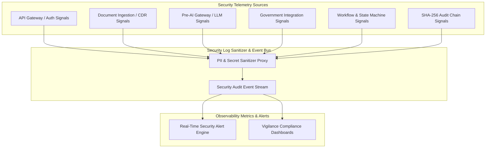
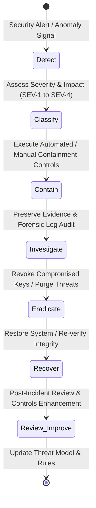

# Phase 1 — Security Observability & Incident Response Architecture Specification

**Document Control Information**
- **Project Name:** SIH26100 — AI-Powered Integrated Bid Compliance Verification Platform for GeM Procurement
- **Organization:** Ministry of Petroleum & Natural Gas / CPCL
- **Document Version:** 1.0.0 (Phase 1 — Task 8 Security Observability & IR Specification)
- **Status:** DESIGN DRAFT / PENDING REVIEW
- **Security Classification:** INTERNAL
- **Mode:** DESIGN ONLY — ZERO CODE IMPLEMENTATION

---

## 1. Executive Summary & Purpose

This specification defines the security observability, security event monitoring, and incident response architecture for the SIH26100 platform. Continuous monitoring and rapid, structured incident response are required to protect government procurement data against security breaches, malicious uploads, audit tampering, and AI prompt injection attacks.

The core operational security principle is:
> **"Comprehensive security observability detects threats in real time; structured incident response contains compromises, preserves evidence integrity, and restores system security without corrupting ongoing audit trails."**

---

## 2. Security Observability & Audit Signal Taxonomies

Integrating Task 7 observability architecture, the platform emits structured security signals across twelve operational domains:

### 2.1 Twelve Security Telemetry Signal Categories

| Category ID | Signal Category | Monitored Event Types & Triggers | Security Metric / Threshold |
|---|---|---|---|
| **SIG-01** | **Authentication Failures** | Invalid passwords, expired JWT tokens, invalid OIDC claims, repeated login failures. | $> 5$ failed attempts within 5 min per user/IP. |
| **SIG-02** | **Authorization Denials** | 403 Forbidden responses, cross-organization resource access attempts, capability violations. | $> 3$ capability denials within 10 min per user session. |
| **SIG-03** | **Unusual Access Patterns** | Out-of-hours logins, rapid geographical IP location jumps, bulk data download requests. | Velocity anomaly trigger / multi-record fetch spike. |
| **SIG-04** | **Document Upload Failures** | Repeated magic-byte mismatches, zip bomb decompression rejects, malformed header uploads. | $> 3$ file validation failures within 5 min per IP. |
| **SIG-05** | **Malware Detections** | ClamAV virus detection, malicious macro signature discovery, quarantine file isolation. | Immediate trigger on any positive virus signature match. |
| **SIG-06** | **Prompt Injection Attacks** | Indirect prompt injection text in PDFs, system prompt override keywords in prompts. | Immediate trigger on regex prompt override keyword match. |
| **SIG-07** | **Abnormal AI Usage** | Spikes in LLM token consumption, high extraction failure rates, schema validation rejections. | Token consumption $> 300\%$ above rolling baseline. |
| **SIG-08** | **Government Credential Errors** | Invalid MCA/GSTN API keys, mTLS certificate validation failures, rate-limit 429s from portals. | Immediate trigger on credential authentication failure. |
| **SIG-09** | **Workflow Execution Anomalies**| Celery task execution timeouts, unhandled task exceptions, rapid job retry loops. | Queue task retry limit reached ($> 3$ attempts). |
| **SIG-10** | **Queue Abuse / Flooding** | Redis channel memory spikes, un-authenticated Redis connection attempts, DLQ depth spikes. | Dead-letter queue depth $> 50$ items. |
| **SIG-11** | **Audit Hash Integrity Anomalies** | Disruption in SHA-256 hash linkage ($H_n \neq \text{SHA256}(H_{n-1} \parallel P_n)$), missing sequence numbers. | Critical immediate trigger on any hash chain mismatch. |
| **SIG-12** | **Data Export / Unmask Anomalies** | High frequency of `PII_UNMASK_VIEWED` capability invocations, bulk CSV/PDF evaluation exports. | Unmask invocations $> 20$ per hour per officer. |

---

## 3. Incident Response Lifecycle Architecture

When a security event or anomaly triggers a high-severity alert, the platform follows a structured seven-stage incident response lifecycle:

---

## 4. Incident Response Playbooks across Core Threat Scenarios

The architecture defines standardized response playbooks for eight primary security incident classes:

### 4.1 Incident Scenario Matrix

| Incident ID | Incident Category | Severity Level | Automated / Manual Containment Actions | Evidence Preservation | Recovery & Restoration |
|---|---|---|---|---|---|
| **INC-01** | **User Credential Compromise** | **SEV-2 (High)** | Instantly add token `jti` to Redis revocation blocklist; lock user account in OIDC IdP; terminate active sessions. | Snapshot user session logs, IP access history, and recent API invocations to isolated audit folder. | Require mandatory password reset and step-up MFA re-verification before unlocking account. |
| **INC-02** | **Malicious Document Ingestion** | **SEV-2 (High)** | Flag uploaded file as quarantined (`QUARANTINED`); block promotion to valid storage; isolate file object. | Preserve original raw upload in isolated quarantine storage for malware reverse engineering. | Purge temporary CDR scratch files; resume processing pipeline for clean documents. |
| **INC-03** | **Unauthorized Access Attempt** | **SEV-3 (Medium)** | Revoke offending session token; block IP at WAF level if threshold exceeded; return 403 Forbidden. | Record `AUTHZ_FAILURE` in SHA-256 audit ledger with actor ULID, target resource, and IP address. | Restore standard rate limiting after IP cooldown period. |
| **INC-04** | **Sensitive Data Leakage** | **SEV-1 (Critical)** | Suspend affected API export endpoint; revoke compromised API keys; notify Data Privacy Officer. | Capture snapshot of API request/response payloads, active session IDs, and database access logs. | Apply additional PII masking rules; reissue API credentials; execute impact assessment. |
| **INC-05** | **AI Prompt Injection Attack** | **SEV-2 (High)** | Reject extracted draft payload; tag document as `HIGH_RISK_INJECTION`; route bid to manual human review. | Store raw PDF text snippet, sanitized prompt payload, and raw LLM response in security analysis log. | Update Pre-AI Gateway regex injection filters; re-process document under updated prompt rules. |
| **INC-06** | **Suspicious Workflow Anomaly** | **SEV-3 (Medium)** | Transition affected workflow state to `PAUSED`; hold pending task execution in Celery queue. | Dump workflow state machine execution trace, task attempt payloads, and worker container logs. | Resume workflow from last valid state checkpoint after technical verification. |
| **INC-07** | **Government Credential Compromise** | **SEV-1 (Critical)** | Deactivate compromised government API key/certificate in Key Vault; switch adapter to `MANUAL_FALLBACK`. | Preserve outbound gateway transport logs, Key Vault access logs, and correlation IDs. | Rotate government API keys in vault; re-verify certificate trust chains; restore `LIVE` adapter mode. |
| **INC-08** | **Audit Hash Chain Anomaly** | **SEV-1 (Critical)** | Lock database modifications on affected table; raise critical vigilance alert to Lead Auditor. | Take immediate read-only cryptographic snapshot of entire PostgreSQL `AuditEvent` table and current SHA-256 hashes. | Execute automated audit verifier to locate point of divergence; restore database from verified clean backup if tampering confirmed. |

---

## 5. Security Incident Severity Classification Framework

Incidents are classified into four explicit severity levels governing escalation and response time objectives:

| Severity Level | Definition & Operational Impact | Target Containment Window | Notification & Escalation Escalation |
|---|---|---|---|
| **SEV-1 (Critical)** | Compromise of system integrity, audit hash chain tampering, government API key leak, mass data exfiltration. | $< 15$ Minutes | Immediate alert to Chief Information Security Officer (CISO), CPCL Vigilance Lead, System Admin. |
| **SEV-2 (High)** | Malware upload attempt, active prompt injection attempt, single user account compromise, localized PII leak. | $< 1$ Hour | Alert to Security Operations Lead, Lead Application Architect, Department Manager. |
| **SEV-3 (Medium)** | Repeated API rate-limit breaches, isolated authorization failures, single government API transport failure. | $< 4$ Hours | Alert to On-Call System Engineer and Application Support Team. |
| **SEV-4 (Low)** | Minor configuration warning, non-critical log sanitization notice, isolated transient timeout. | $< 24$ Hours | Summarized in daily operational security reports. |

---

## 6. Evidence Preservation & Forensic Integrity Rules

To support potential legal proceedings or CVC vigilance investigations, incident evidence handling enforces four strict rules:
1. **Chain of Custody:** All log files, raw document uploads, and database snapshots collected during incident response are hashed immediately using SHA-256 and written to write-once-read-many (WORM) storage.
2. **Non-Destructive Investigation:** Incident investigation takes place on isolated copies of logs and database snapshots; production database tables and live audit hash chains are never modified during forensic analysis.
3. **Audit Event Logging of IR Actions:** Administrative containment actions (such as revoking user sessions, locking accounts, or pausing workflows) generate explicit `INCIDENT_RESPONSE_ACTION` events recorded in the tamper-evident SHA-256 audit ledger.
4. **Post-Incident Review:** Every SEV-1 and SEV-2 incident requires a mandatory Post-Incident Review (PIR) document detailing root cause analysis, timeline, containment effectiveness, and architectural improvements.
