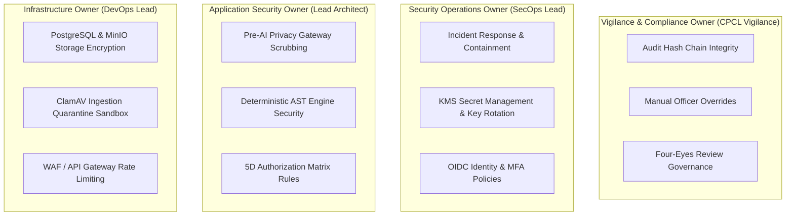

# Phase 1 — Security Responsibility Matrix (RACI) Specification

**Document Control Information**
- **Project Name:** SIH26100 — AI-Powered Integrated Bid Compliance Verification Platform for GeM Procurement
- **Organization:** Ministry of Petroleum & Natural Gas / CPCL
- **Document Version:** 1.0.0 (Phase 1 — Task 8 Security Responsibility Matrix)
- **Status:** DESIGN DRAFT / PENDING REVIEW
- **Security Classification:** INTERNAL
- **Mode:** DESIGN ONLY — ZERO CODE IMPLEMENTATION

---

## 1. Executive Summary & Purpose

This specification establishes the comprehensive Security Responsibility Matrix for the SIH26100 platform. Securing an AI-assisted government procurement platform requires an explicit distribution of operational and technical responsibilities across fourteen human roles, application subsystems, background services, storage engines, and external dependency boundaries.

The core responsibility principle is:
> **"Every security domain—authentication, authorization, data protection, audit, incident response, and failure recovery—must have unambiguous ownership assigned across system roles and software components."**

---

## 2. RACI Definitions

Security responsibilities are assigned across six core security dimensions using the **RACI** framework:
- **R — Responsible:** The entity that performs the activity or executes the technical control.
- **A — Accountable:** The entity with ultimate decision-making authority and ownership of the security outcome.
- **C — Consulted:** The entity providing advisory input, security requirements, or contextual validation.
- **I — Informed:** The entity notified of security outcomes, status changes, or incident alerts.

---

## 3. Fourteen-Entity Security Responsibility Matrix

The matrix below maps fourteen system entities across six critical security responsibilities:

| System Entity / Component | 1. Authentication Responsibility | 2. Authorization Responsibility | 3. Data Protection Responsibility | 4. Audit Responsibility | 5. Incident Response Responsibility | 6. Failure Recovery Responsibility |
|---|---|---|---|---|---|---|
| **1. Procurement Officer** | **R / A** (Protect user credentials & session tokens) | **R** (Operate strictly within assigned org context) | **R** (Maintain confidentiality of unmasked bid data) | **A** (Provide valid rationale for manual overrides) | **I** (Report credential leaks or suspicious system behavior) | **I** (Follow manual fallback procedures during outages) |
| **2. Senior Reviewer** | **R / A** (Protect reviewer credentials & MFA) | **R / A** (Approve high-risk overrides & four-eyes checks) | **R** (Verify privacy compliance on escalated bids) | **A** (Sign off on dual-control review audit records) | **C** (Assist in investigating evaluation anomalies) | **R** (Authorize workflow checkpoint resumes) |
| **3. Auditor / Vigilance Lead**| **R / A** (Protect read-only auditor credentials) | **I** (Inspect access controls & capability matrices) | **I** (Monitor PII unmasking & data export events) | **R / A** (Verify SHA-256 audit ledger hash integrity) | **C** (Review SEV-1 audit anomalies & forensic logs) | **I** (Receive audit recovery confirmation reports) |
| **4. System Administrator** | **R** (Manage OIDC user provisioning & group maps) | **R** (Configure RBAC roles & capability policies) | **R** (Configure environment settings & storage policies) | **I** (Monitor admin action logs) | **R** (Execute technical account locks & containment) | **R** (Assist in technical system recovery) |
| **5. Core Application Services**| **R** (Validate incoming JWT tokens & claims) | **R** (Enforce 5D authorization formula per API call) | **R** (Execute AES-256 field encryption & UI masking) | **R** (Emit structured `AuditEvent` payloads) | **R** (Enforce automatic rate limits & WAF blocks) | **R** (Return standardized RFC 7807 error responses) |
| **6. Workflow Orchestrator** | **R** (Verify internal M2M task execution tokens) | **R** (Verify task execution capabilities per DAG node) | **R** (Minimize task payloads in Celery queues) | **R** (Emit workflow state transition audit events) | **R** (Execute two-phase graceful cancellations) | **R** (Execute backoff jitter retries & DLQ routing) |
| **7. Pre-AI Privacy Gateway** | **I** (Operate under internal service token) | **R** (Enforce AI model routing eligibility policies) | **R / A** (Scrub PII, tokenize sensitive fields, validate schema) | **R** (Log pre-AI entity detection & redaction counts) | **R** (Block prompt injection keyword attempts) | **R** (Route failed extractions to local fallback models) |
| **8. External AI Provider** | **R** (Authenticate API key via transport header) | **I** (Execute text completion under API contract) | **A** (Enforce zero-data-retention & no-training policies) | **I** (Provide request usage metrics) | **I** (Report API outages or service degradation) | **R** (Return standard API rate-limit headers) |
| **9. Govt Integration Adapter** | **R** (Manage scoped API keys & mTLS certificates) | **R** (Query only Authorized Source Registry portals) | **R** (Encrypt raw government verification payloads) | **R** (Log outbound request correlation IDs) | **R** (Trigger circuit breakers on high error rates) | **R** (Isolate transport errors from business status) |
| **10. External Govt Registry** | **A** (Authenticate adapter requests) | **A** (Provide authoritative verification results) | **A** (Protect government registry records) | **I** (Maintain portal transaction logs) | **I** (Report portal maintenance windows) | **A** (Restore government portal availability) |
| **11. PostgreSQL Database** | **R** (Enforce DB user password & TLS transport) | **R** (Enforce least-privilege DB user permissions) | **R** (Encrypt database tables & backups at rest) | **R / A** (Maintain append-only SHA-256 audit ledger) | **I** (Provide database performance logs) | **R** (Execute transaction rollbacks on error) |
| **12. Object Storage (MinIO)** | **R** (Validate internal S3 credentials) | **R** (Enforce private bucket policies (`PRIVATE`)) | **R** (Encrypt objects at rest via SSE-S3) | **R** (Log S3 object access & pre-signed URL reads) | **R** (Isolate infected uploads in quarantine) | **R** (Maintain object versioning & replication) |
| **13. Redis Task Queue** | **R** (Enforce TLS 1.3 & password `AUTH`) | **R** (Isolate queue access to internal container subnet)| **R** (Evict temporary cache items via TTL limits) | **I** (Log authentication failure attempts) | **R** (Isolate poison-pill messages in DLQ) | **R** (Persist queue state across container restarts) |
| **14. Security Operations (SecOps)**| **A** (Oversee OIDC identity provider integration) | **A** (Audit system access control matrices) | **A** (Oversee KMS secret management & key rotation) | **A** (Review daily SHA-256 hash integrity reports) | **R / A** (Lead Incident Response team & PIRs) | **A** (Authorize system recovery post-incident) |

---

## 4. Key Operational Ownership Boundaries

To ensure clear escalation during operational events, primary accountability is divided across four security domain owners:

---

## 5. Summary of Security Responsibility Assignments

- **Authentication Ownership:** Shared between Enterprise OIDC Identity Provider (human identity) and Key Vault / KMS (machine & government integration credentials).
- **Authorization Ownership:** Application Core (`PolicyEngine`) enforcing 5-dimensional access control rules per API route.
- **Data Protection Ownership:** Pre-AI Privacy Gateway (PII scrubbing), PostgreSQL Engine (AES-256 field encryption), and MinIO Storage (SSE-S3 object encryption).
- **Audit Ownership:** PostgreSQL Append-Only Ledger (`AuditEvent`) enforcing sequential SHA-256 hash-chain linkage, overseen by CPCL Vigilance.
- **Incident Response Ownership:** Security Operations (SecOps Lead) orchestrating containment playbooks and post-incident reviews.
- **Failure Recovery Ownership:** Workflow Orchestrator (Celery retries & circuit breakers) and Infrastructure Team (database restores & system recovery).
