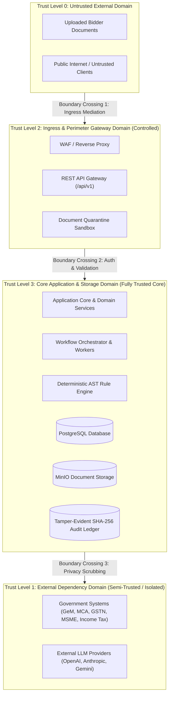
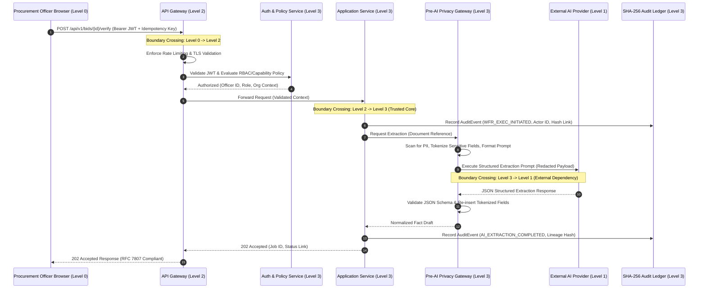

# Phase 1 — Security Trust Boundaries Architecture

**Document Control Information**
- **Project Name:** SIH26100 — AI-Powered Integrated Bid Compliance Verification Platform for GeM Procurement
- **Organization:** Ministry of Petroleum & Natural Gas / CPCL
- **Document Version:** 1.0.0 (Phase 1 — Task 8 Trust Boundary Specification)
- **Status:** DESIGN DRAFT / PENDING REVIEW
- **Security Classification:** INTERNAL
- **Mode:** DESIGN ONLY — ZERO CODE IMPLEMENTATION

---

## 1. Executive Summary & Purpose

This specification defines the formal trust boundary model for the SIH26100 platform. Systems that process sensitive procurement data, commercial bidder financial filings, government identity records, and AI models must explicitly define where trust originates, where it transitions, and what security controls mediate transitions across boundaries.

The core trust principle is:
> **"Every data flow crossing a trust boundary must be explicitly authenticated, authorized, validated, and logged. No external input, document payload, or third-party service response is trusted by implicit network position."**

---

## 2. Trust Level Categorization

The architecture establishes four explicit levels of trust across system components:

---

## 3. Subsystem Trust Taxonomy

The system architecture partitions fifteen key components into four formal trust zones:

| Component ID | Component Name | Trust Classification | Security Rationale |
|---|---|---|---|
| **C-01** | External Uploaded Documents | **UNTRUSTED (Level 0)** | Arbitrary PDFs, zip archives, scans, and attachments submitted by bidders. May contain malware, macros, oversized payloads, or prompt injection exploits. |
| **C-02** | User Browser / Client | **UNTRUSTED (Level 0)** | Execution takes place on client devices outside system control. Susceptible to client-side tampering, DOM inspection, and XSS risks. |
| **C-03** | External AI Providers | **SEMI-TRUSTED (Level 1)** | External cloud APIs (OpenAI, Anthropic, Gemini). Process prompts under strict data-privacy contracts; must not receive unredacted PII or secrets. |
| **C-04** | External Government Systems | **SEMI-TRUSTED (Level 1)** | External government portals (MCA, GSTN, Income Tax, GeM API). Data is authoritative but external connectivity requires TLS, rate limiting, and timeout protections. |
| **C-05** | API Gateway Boundary | **CONTROLLED (Level 2)** | Ingress interface handling routing, rate limiting, TLS termination, and token verification. Shields internal services from raw client requests. |
| **C-06** | Ingestion & Quarantine Sandbox | **CONTROLLED (Level 2)** | Isolated execution sandbox for file validation, MIME type checking, virus scanning, and safe metadata extraction before storage. |
| **C-07** | Authenticated User Identity | **CONTROLLED (Level 2)** | Procurement Officers, Reviewers, and Auditors authenticated via OAuth2/OIDC JWT tokens. Access mediated by RBAC and capability policies. |
| **C-08** | Core Application Services | **TRUSTED CORE (Level 3)** | Internal business logic, tender management, compliance aggregation, and evaluation services operating inside protected network space. |
| **C-09** | Workflow Orchestrator & Workers | **TRUSTED CORE (Level 3)** | Celery background task runners executing DAG steps, orchestrating evaluations, and managing state transitions. |
| **C-10** | Pre-AI Privacy Gateway | **TRUSTED CORE (Level 3)** | Internal filter validating, tokenizing, and redacting sensitive PII/fields before constructing prompts for AI provider execution. |
| **C-11** | Government Adapter Gateway | **TRUSTED CORE (Level 3)** | Internal subsystem managing government API credentials, handling retries, circuit breakers, and normalizing verification responses. |
| **C-12** | Deterministic AST Rule Engine | **TRUSTED CORE (Level 3)** | Safe Python/Pydantic expression engine executing pure, non-executable AST tree evaluations. Zero `eval()`/`exec()`. |
| **C-13** | Primary PostgreSQL Database | **TRUSTED CORE (Level 3)** | Encrypted relational database storing structured entity models, normalized facts, policy versions, and evaluation traces. |
| **C-14** | Object / Document Storage (MinIO) | **TRUSTED CORE (Level 3)** | S3-compatible private object store hosting validated tender and bidder documents. Public bucket access is completely prohibited. |
| **C-15** | Redis Task Queue | **TRUSTED CORE (Level 3)** | In-memory message broker managing background job distribution. Requires TLS and strong password authentication. |
| **C-16** | Tamper-Evident Audit Subsystem | **TRUSTED CORE (Level 3)** | Sequential SHA-256 hash-chained audit storage guaranteeing tamper evidence for all system state changes. |
| **C-17** | Observability & Telemetry | **TRUSTED CORE (Level 3)** | Internal logging, metric aggregation, and tracing pipelines. Redacts secrets, tokens, and PII before log ingestion. |

---

## 4. Trust Boundary Crossings & Security Mediation Controls

Every data movement crossing a boundary between different trust classifications requires specific security mediation controls:

### 4.1 Boundary Crossing 1: External Client to API Gateway (Level 0 $\rightarrow$ Level 2)
- **Threats:** Request flooding (DoS), malformed JSON payloads, credential brute-forcing, expired/forged JWT tokens.
- **Mediation Controls:**
  - Mandatory TLS 1.3 encryption.
  - API Gateway rate limiting (leaky bucket algorithm, IP throttling).
  - Schema validation for all incoming HTTP request bodies against OpenAPI 3.1.0 specifications.
  - JWT signature and expiration verification against internal OIDC issuer public key.

### 4.2 Boundary Crossing 2: Document Upload to Ingestion Sandbox (Level 0 $\rightarrow$ Level 2)
- **Threats:** Embedded malware, executable macros, zip bombs, polyglot PDFs, prompt injection hidden text.
- **Mediation Controls:**
  - File extension and magic byte MIME verification.
  - ClamAV malware scanning in an isolated container sandbox.
  - Decompression size and ratio checks for compressed archives.
  - Quarantine placement for any failed document check.

### 4.3 Boundary Crossing 3: Application Core to External AI Provider (Level 3 $\rightarrow$ Level 1)
- **Threats:** Leakage of sensitive PII, PAN, corporate financial secrets; prompt injection command execution.
- **Mediation Controls:**
  - Pre-AI Privacy Gateway inspection.
  - Automated regex and NLP entity scrubbing for sensitive PII.
  - Provider abstraction interface enforcing vendor data privacy settings (zero retention, no training on API data).
  - Output schema validation suppressing invalid or malicious AI responses.

### 4.4 Boundary Crossing 4: Application Core to External Government APIs (Level 3 $\rightarrow$ Level 1)
- **Threats:** Credential leak in request headers, unencrypted transmission over public internet, API outage thundering herd.
- **Mediation Controls:**
  - Dedicated Government Integration Gateway handling credential injection securely from vault secrets.
  - Mutual TLS (mTLS) or TLS 1.3 transport security.
  - Circuit breaker isolation preventing thundering herd retries during government portal outages.
  - Strict isolation of technical transport failures from domain business verification outcomes.

### 4.5 Boundary Crossing 5: Application Core to Internal Storage Boundary (Level 3 Core $\rightarrow$ Level 3 Data)
- **Threats:** Direct database manipulation, unauthorized SQL injection, file tampering, audit record alteration.
- **Mediation Controls:**
  - Database queries issued exclusively via parameterized SQLAlchemy ORM models. Direct raw SQL execution prohibited.
  - Database access restricted to least-privilege service accounts (application account cannot drop tables or bypass schema constraints).
  - Storage bucket policies enforcing private access only via signed short-lived URLs or internal service tokens.
  - SHA-256 hash-chain verification enforcing immutable audit event history.

---

## 5. Explicit Treatment of Uploaded Documents as Untrusted Content

All documents submitted during bid processing (e.g., technical bid PDFs, financial balance sheets, GST certificates, MSME registration scans) are treated as **Untrusted Content (Level 0)**.

The document handling architecture enforces five isolation invariants:
1. **Never Process in Application Context:** Documents are never parsed directly inside the web server process or main application API thread.
2. **Quarantine Before Storage:** Documents are uploaded to a staging quarantine bucket (`staging-quarantine/`) before virus scanning and content disarm processing. Only disarmed, clean documents are moved to the primary MinIO tender storage bucket.
3. **Sandbox Parsing Isolation:** OCR conversion, text extraction, and PDF table parsing execute inside isolated background worker containers with strict memory caps, restricted user privileges, and zero outgoing internet access.
4. **Metadata Scrubbing:** Unnecessary EXIF metadata, embedded Javascript, dynamic form fields, and macro streams are disarmed and stripped during parsing.
5. **Untrusted Content Labeling:** All text extracted from uploaded documents carries an immutable `untrusted_content_source = TRUE` metadata flag throughout the AI and processing pipeline to prevent prompt injection hijacking.

---

## 6. Summary Matrix of Boundary Controls

| Crossing Point | From Zone | To Zone | Key Security Controls | Failure Mode |
|---|---|---|---|---|
| User Request | Level 0 (Browser) | Level 2 (API Gateway) | WAF, TLS 1.3, OAuth2 JWT Auth, Rate Limiting | Reject (401 / 429) |
| Document Ingestion | Level 0 (Upload) | Level 2 (Quarantine) | MIME Check, Magic Bytes, Malware Scan, Size Limits | Quarantine & Reject (400) |
| Internal Service Call | Level 2 (Gateway) | Level 3 (App Core) | TLS, Internal Service Auth, Correlation IDs | Internal Error (500) |
| AI Pipeline Call | Level 3 (App Core) | Level 1 (External LLM) | Pre-AI Scrubbing, PII Masking, Schema Enforcement | Fallback / Local Model |
| Govt API Call | Level 3 (App Core) | Level 1 (Govt Portal) | Credential Isolation, mTLS, Circuit Breaker | Manual Fallback Workflow |
| DB / Storage Write | Level 3 (App Core) | Level 3 (Storage) | Parameterized Queries, AES-256 Field Encryption, SHA-256 Audit | Transaction Rollback |
