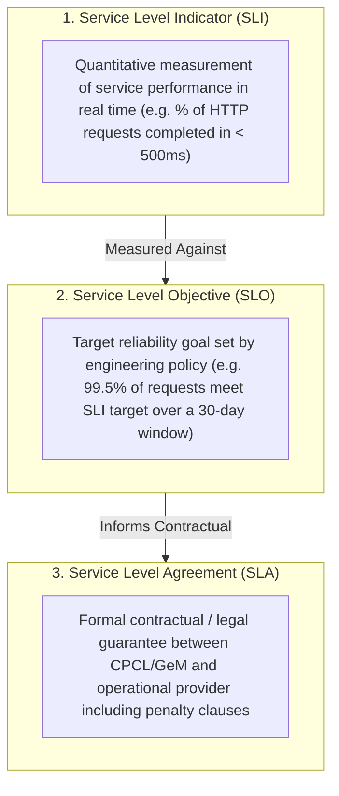

# Phase 1 — Candidate Service Level Indicators (SLIs) & Objectives (SLOs) Architecture

**Document Control Information**
- **Project Name:** SIH26100 — AI-Powered Integrated Bid Compliance Verification Platform for GeM Procurement
- **Organization:** Ministry of Petroleum & Natural Gas / CPCL
- **Document Version:** 1.0.0 (Phase 1 — Task 9 SLI/SLO Architecture Specification)
- **Status:** DESIGN DRAFT / PENDING REVIEW
- **Security Classification:** INTERNAL
- **Mode:** DESIGN ONLY — ZERO CODE IMPLEMENTATION

---

## 1. Executive Summary & Purpose

This specification defines the candidate Service Level Indicators (SLIs), proposed Service Level Objectives (SLOs), and Service Level Agreement (SLA) boundaries for the SIH26100 platform. Establishing clear reliability targets allows engineering and operations teams to measure system performance against objective reliability goals.

The governing reliability principle is:
> **"SLIs and SLOs are proposed operational benchmarks framed as candidate architectural targets. They MUST NOT be presented as legally binding SLAs until finalized by department policy and staging benchmarks."**

---

## 2. Core Concepts: SLI vs. SLO vs. SLA Distinction

The architecture distinguishes three core reliability definitions:

---

## 3. Master Candidate SLI / SLO Catalog

> **"Illustrative examples only; not production commitments. All numerical targets, measurement windows, and thresholds are candidate, proposed, policy-defined, and environment-dependent."**

The following table documents proposed candidate SLIs and SLOs across nine core operational areas:

| Area ID | Service Area | Candidate Service Level Indicator (SLI) Formula | Proposed SLO Target | Measurement Window | Exclusions & Exemption Criteria |
|---|---|---|---|---|---|
| **SLO-01** | **API Availability** | $\frac{\text{Successful HTTP Requests (2xx, 3xx, 4xx)}}{\text{Total Valid HTTP Requests}} \times 100$ | **99.5%** | 30 Rolling Days | Excludes scheduled maintenance windows & client-side 4xx errors. |
| **SLO-02** | **API Latency** | $\frac{\text{HTTP Requests Completed in } < 500\text{ms}}{\text{Total HTTP Requests}} \times 100$ | **95.0%** (p95) | 30 Rolling Days | Excludes heavy document upload endpoints. |
| **SLO-03** | **Workflow Completion** | $\frac{\text{Workflows Completed without Technical Error}}{\text{Total Workflows Initiated}} \times 100$ | **99.0%** | 30 Rolling Days | Excludes workflows intentionally paused for human officer review. |
| **SLO-04** | **Document Processing** | $\frac{\text{Documents Scanned \& CDR Disarmed in } < 10\text{s}}{\text{Total Uploaded Documents}} \times 100$ | **90.0%** | 30 Rolling Days | Excludes oversized files $> 50$MB or complex archive zips. |
| **SLO-05** | **AI Extraction Latency** | $\frac{\text{AI Extractions Completed in } < 5.0\text{s}}{\text{Total AI Gateway Requests}} \times 100$ | **90.0%** | 30 Rolling Days | Excludes external LLM API service degradation windows. |
| **SLO-06** | **Govt Verification** | $\frac{\text{Govt Requests Returning Status in } < 3.0\text{s}}{\text{Total Outbound Integration Requests}} \times 100$ | **85.0%** | 30 Rolling Days | Excludes government portal maintenance windows and `MANUAL_FALLBACK` cases. |
| **SLO-07** | **Compliance Engine** | $\frac{\text{AST Rule Evaluations Completed in } < 100\text{ms}}{\text{Total Compliance Evaluations}} \times 100$ | **99.0%** | 30 Rolling Days | None. AST tree evaluations execute pure memory calculations. |
| **SLO-08** | **Audit Persistence** | $\frac{\text{AuditEvent Hash Chain Writes Committed in } < 50\text{ms}}{\text{Total Audit Write Operations}} \times 100$ | **99.9%** | 30 Rolling Days | Zero exceptions. Audit ledger writes are critical path operations. |
| **SLO-09** | **Review Queue SLA** | $\frac{\text{Human Review Checkpoints Processed in } < 24\text{h}}{\text{Total Review Queue Items}} \times 100$ | **90.0%** | 30 Rolling Days | Excludes official weekend / government holiday non-working days. |

---

## 4. Measurement Windows & Degradation Handling

1. **Rolling 30-Day Window:** All SLO calculations evaluate over a rolling 30-calendar-day window to prevent short transient spikes from skewing monthly reliability trends.
2. **Graceful Degradation Thresholds:** If an SLI breaches its SLO target (e.g., API latency p95 exceeds 500ms), the system enters `DEGRADED` operational mode, triggering non-critical worker throttling and alerting operational leads.
3. **Non-Production Environment Adjustments:** Staging, sandbox, and development environments operate under separate, relaxed SLO benchmarks.
