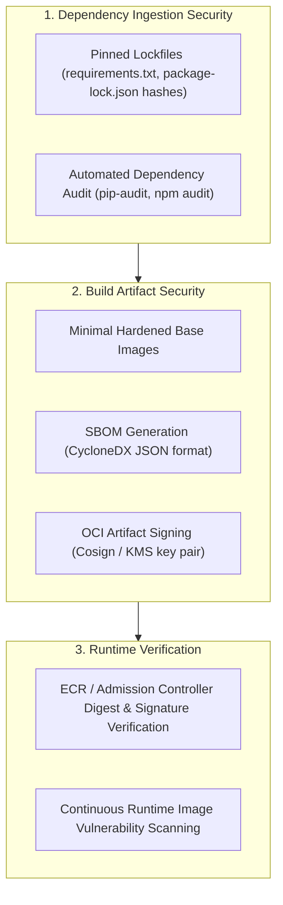

# Phase 1 — Supply Chain Security Architecture Specification

**Document Control Information**
- **Project Name:** SIH26100 — AI-Powered Integrated Bid Compliance Verification Platform for GeM Procurement
- **Organization:** Ministry of Petroleum & Natural Gas / CPCL
- **Document Version:** 1.0.0 (Phase 1 — Task 10 Supply Chain Specification)
- **Status:** DESIGN DRAFT / PENDING REVIEW
- **Security Classification:** INTERNAL
- **Mode:** DESIGN ONLY — ZERO CODE IMPLEMENTATION

---

## 1. Executive Summary & Purpose

This specification defines supply-chain security controls, dependency locking, Software Bill of Materials (SBOM) generation, container image signing, and artifact provenance verification.

> **"Third-party packages, base images, and external dependencies are untrusted vectors. Deployments reference immutable container image digests; human-readable version tags may accompany them. Artifact signing/provenance is a supply-chain security control and is independent of the application's tamper-evident AuditEvent SHA-256 hash chain."**

---

## 2. Supply-Chain Security Controls Framework

---

## 3. Supply-Chain Verification Matrix

| Verification Target | Tool / Mechanism | Target Output / Standard | Enforcement Rule |
|---|---|---|---|
| **Python Dependencies** | `pip-audit`, `safety` | Zero `HIGH` / `CRITICAL` vulnerability matches | Lockfile hash mismatch or vulnerability blocks build |
| **Node.js Packages** | `npm audit` | Zero `HIGH` / `CRITICAL` vulnerability matches | Vulnerability in runtime dependencies blocks build |
| **Container Images** | `trivy`, `syft` | CycloneDX SBOM + Vulnerability Report | Image missing SBOM or containing critical CVE blocked; references image digests |
| **Artifact Provenance** | `cosign` | Signed OCI Image Signature in Registry | Supply-chain signing verification; completely independent of AuditEvent SHA-256 hash chain |
