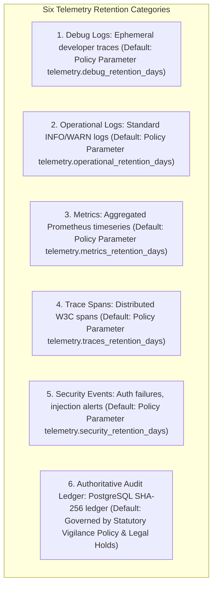

# Phase 1 — Telemetry Retention & Lifecycle Governance Architecture

**Document Control Information**
- **Project Name:** SIH26100 — AI-Powered Integrated Bid Compliance Verification Platform for GeM Procurement
- **Organization:** Ministry of Petroleum & Natural Gas / CPCL
- **Document Version:** 1.0.0 (Phase 1 — Task 9 Telemetry Retention Specification)
- **Status:** DESIGN DRAFT / PENDING REVIEW
- **Security Classification:** INTERNAL
- **Mode:** DESIGN ONLY — ZERO CODE IMPLEMENTATION

---

## 1. Executive Summary & Purpose

This specification defines the retention and lifecycle governance architecture for telemetry streams (logs, metrics, distributed traces, security events, operational events, and audit references). Storage allocations for observability data must be managed efficiently to avoid unbounded disk growth while satisfying statutory vigilance and data protection requirements.

The core retention governance principle is:
> **"Telemetry retention MUST be policy-controlled, classification-aware, and dynamically bound to system configuration settings. Universal fixed retention periods are strictly prohibited."**

---

## 2. Telemetry Retention Category Matrix

Retention lifetimes are managed across six distinct telemetry categories:

---

## 3. Policy-Controlled Retention Parameters

| Telemetry Data Category | Policy Control Parameter | Default Architectural Policy Range | Retention Cleanup Action |
|---|---|---|---|
| **Debug Logs** | `telemetry.debug_retention_days` | 3 to 7 Days | Automated Index Purge |
| **Operational Application Logs**| `telemetry.operational_retention_days` | 30 to 90 Days | Automated Compress & Archive |
| **Performance Metrics** | `telemetry.metrics_retention_days` | 30 Days (Detailed) / 365 Days (Rollup) | Aggregated Downsampling |
| **Distributed Trace Spans** | `telemetry.traces_retention_days` | 14 to 30 Days | Tail-Sampling Purge |
| **Security Event Telemetry** | `telemetry.security_retention_days` | 180 to 365 Days | Encrypted Long-Term Archive |
| **Authoritative Audit Ledger** | Statutory Policy / Legal Hold | Retained for Tender Duration + Archive | Policy-Controlled Tombstone |

---

## 4. Legal & Vigilance Hold Integration

- **Legal Hold Override:** Placing a `LegalHold` on a tender or bid submission freezes automated retention cleanup jobs for all associated security events, operational logs, and trace spans.
- **Dual-Control Purge:** Deleting archived security logs or telemetry indices prior to policy expiration requires dual-control approval from both a System Administrator and Lead Auditor.
- **Disposal Audit Log:** Executing automated telemetry retention cleanups emits a `TELEMETRY_RETENTION_CLEANUP_EXECUTED` event in the audit ledger, detailing indices purged and date ranges covered.
