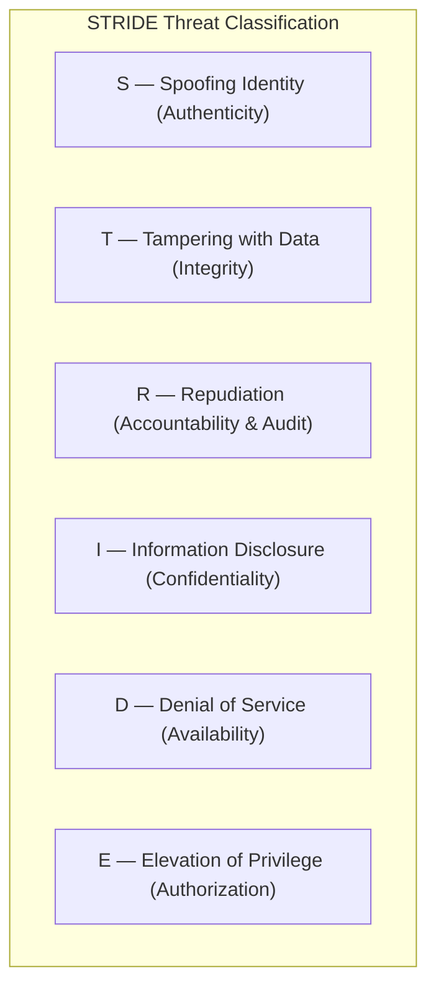
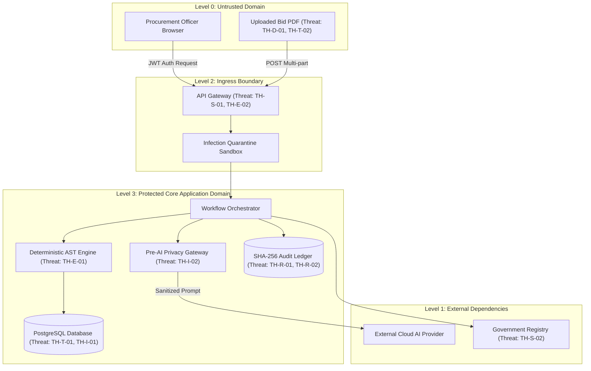

# Phase 1 — Comprehensive STRIDE Threat Model Specification

**Document Control Information**
- **Project Name:** SIH26100 — AI-Powered Integrated Bid Compliance Verification Platform for GeM Procurement
- **Organization:** Ministry of Petroleum & Natural Gas / CPCL
- **Document Version:** 1.0.0 (Phase 1 — Task 8 STRIDE Threat Model)
- **Status:** DESIGN DRAFT / PENDING REVIEW
- **Security Classification:** INTERNAL
- **Mode:** DESIGN ONLY — ZERO CODE IMPLEMENTATION

---

## 1. Executive Summary & Purpose

This specification documents the formal threat model for the SIH26100 platform using the industry-standard **STRIDE** methodology (Spoofing, Tampering, Repudiation, Information Disclosure, Denial of Service, Elevation of Privilege). It systematically analyzes potential threats across sixteen core assets and system components.

The governing threat modeling principle is:
> **"Security controls reduce risk but never eliminate it entirely. Every identified threat must be mapped to architectural mitigations, detection mechanisms, clear control ownership, and explicit residual risk acknowledgments."**

---

## 2. STRIDE Methodology Framework

The STRIDE framework categorizes security threats into six distinct categories:

---

## 3. Comprehensive System Threat Matrix

The following matrix documents sixteen critical threat scenarios analyzed across trust boundaries, identifying assets, mitigations, detection mechanisms, and residual risk:

### 3.1 Spoofing Identity (Authenticity)

| Threat ID | Target Asset | Attack Vector & Trust Boundary | Impact | Architectural Mitigation | Detection Mechanism | Residual Risk & Owner |
|---|---|---|---|---|---|---|
| **TH-S-01** | User Session / API | Attacker steals or forges JWT OAuth2 session token crossing Level 0 $\rightarrow$ Level 2 boundary. | High (Unauthorized access to bid evaluation system) | OIDC/OAuth2 short-lived JWT tokens (15 min exp), RS256 signature verification, Redis token revocation blocklist. | Failed JWT signature logs, IP velocity anomaly detection. | Compromised client device can utilize token within 15 min window. **Owner:** Identity Provider. |
| **TH-S-02** | Government Integration Adapter | Malicious third party spoofs a government registry endpoint (e.g., fake MCA portal) returning bogus verification status. | Critical (False compliance verification) | TLS 1.3 certificate validation, public key pinning, mTLS client certificates, Authorized Source Registry catalog enforcement. | TLS handshake failure logs, certificate validation error alerts. | Compromised upstream DNS / CA root. **Owner:** Security Operations. |

### 3.2 Tampering with Data (Integrity)

| Threat ID | Target Asset | Attack Vector & Trust Boundary | Impact | Architectural Mitigation | Detection Mechanism | Residual Risk & Owner |
|---|---|---|---|---|---|---|
| **TH-T-01** | Extracted Facts & Rule Evaluation | Malicious actor modifies `NormalizedFact` table values in PostgreSQL directly. | Critical (Falsified evaluation PASS outcome) | SHA-256 evidence provenance linkage, parameterized ORM access, least-privilege DB roles, audit hash chain. | Scheduled audit hash-chain integrity verification job. | Insider DB admin with root database access. **Owner:** Database Administrator. |
| **TH-T-02** | Uploaded Bid Document | Attacker alters stored PDF bid document inside MinIO storage bucket after ingestion. | High (Mismatch between evaluation and source doc) | Immature disarmed file hashing; SHA-256 digest recorded in PostgreSQL and verified on re-read. | MinIO object hash mismatch alert on document access. | Physical storage media corruption or root S3 key compromise. **Owner:** Infrastructure Team. |

### 3.3 Repudiation (Accountability & Auditability)

| Threat ID | Target Asset | Attack Vector & Trust Boundary | Impact | Architectural Mitigation | Detection Mechanism | Residual Risk & Owner |
|---|---|---|---|---|---|---|
| **TH-R-01** | Procurement Officer Overrides | Procurement Officer overrides an automated rule `FAIL` to `PASS` and later claims the system made the decision. | Critical (Vigilance liability, un-attributed fraud) | Mandatory `OfficerDecision` entity capturing Officer ULID, timestamp, rationale text, and linked `AuditEvent` in SHA-256 hash ledger. | Automated audit ledger trace report for all manual overrides. | Shared credentials if officer shares password with colleague. **Owner:** Department Management. |
| **TH-R-02** | Audit Ledger Records | Rogue administrator deletes or alters historical audit log entries in PostgreSQL to cover tracks. | Critical (Destroyed legal chain of evidence) | Immutable SHA-256 hash-chained audit ledger ($H_n = \text{SHA256}(H_{n-1} \parallel P_n)$). Append-only DB permissions. | Daily automated hash-chain verification job flagging broken forward linkages. | Complete database wipe from root DB user. **Owner:** Vigilance & Audit. |

### 3.4 Information Disclosure (Confidentiality)

| Threat ID | Target Asset | Attack Vector & Trust Boundary | Impact | Architectural Mitigation | Detection Mechanism | Residual Risk & Owner |
|---|---|---|---|---|---|---|
| **TH-I-01** | Sensitive Bidder PII (PAN/GST/Bank) | Direct database query or unmasked UI view exposing bidder financial/PAN details to unauthorized users. | High (Privacy violation, commercial intelligence leak) | AES-256-GCM field-level database encryption, automatic UI field masking (`XXXXX1234X`), fine-grained capability checks. | Audit logging of all `PII_UNMASK_VIEWED` capability invocations. | Authorized procurement officer leaking unmasked screen data manually. **Owner:** Procurement Operations. |
| **TH-I-02** | External AI Prompt Stream | Unredacted PII or financial secrets transmitted to external cloud LLM API crossing Level 3 $\rightarrow$ Level 1 boundary. | High (Data leakage to third-party AI vendor) | Pre-AI Privacy Gateway entity scrubbing, regex/NLP PII tokenization, vendor zero-data-retention contracts. | Automated pre-AI scrubber logging of detected and redacted entities. | Novel PII formats bypassing NLP regex filters. **Owner:** AI Engineering. |

### 3.5 Denial of Service (Availability)

| Threat ID | Target Asset | Attack Vector & Trust Boundary | Impact | Architectural Mitigation | Detection Mechanism | Residual Risk & Owner |
|---|---|---|---|---|---|---|
| **TH-D-01** | Ingestion Pipeline / Document Parser | Attacker uploads decompression zip bomb or malformed PDF to exhaust server CPU/RAM. | Medium (Worker queue exhaustion, DoS) | Ingress file size limits, decompression ratio caps (10:1), isolated worker containers with strict RAM/CPU bounds. | Container memory limit breach alerts, Celery queue depth monitoring. | Legitimate massive multi-gigabyte bids causing processing delay. **Owner:** System Operations. |
| **TH-D-02** | Async Task Queue (Redis) | Flooding API with mutative verification requests to starve background Celery workers. | Medium (Evaluation processing delay) | Idempotency key enforcement via Redis (`X-Idempotency-Key`), API rate limiting per user/org. | API 429 Rate Limit metrics, Redis queue starvation alerts. | Distributed botnet overwhelming WAF bandwidth. **Owner:** Infrastructure Team. |

### 3.6 Elevation of Privilege (Authorization)

| Threat ID | Target Asset | Attack Vector & Trust Boundary | Impact | Architectural Mitigation | Detection Mechanism | Residual Risk & Owner |
|---|---|---|---|---|---|---|
| **TH-E-01** | Rule Engine AST Evaluator | Malicious rule payload using dynamic code execution (`eval()`, `exec()`) to run arbitrary system code. | Critical (Full remote code execution on server) | Deterministic AST parser executing pure tree traversals. Absolute prohibition of `eval()`, `exec()`, or dynamic imports. | Static AST parser validation, container non-root UID execution. | Zero-day vulnerability in Python core interpreter. **Owner:** Core Development. |
| **TH-E-02** | Role-Based Access Control | Standard Procurement Officer invoking administrative configuration endpoints or viewing other org's bids. | High (Unauthorized cross-tenant data access) | 5-Dimensional authorization formula (`WHO` + `ACTION` + `RESOURCE` + `ORG_CONTEXT` + `CLASSIFICATION`). | API Gateway 403 Forbidden audit event logs. | Application code logic bug in authorization middleware. **Owner:** Application Security. |

---

## 4. Threat-Aware End-to-End Data Flow & Security Boundaries

---

## 5. Summary of STRIDE Mitigations & Residual Risk Balance

| STRIDE Category | Mitigated Threats | Primary Architectural Boundary | Residual Risk Status |
|---|---|---|---|
| **Spoofing** | TH-S-01, TH-S-02 | OAuth2 / OIDC Gateway & mTLS Transport | Managed (Residual window bounded by 15-min JWT lifetime) |
| **Tampering** | TH-T-01, TH-T-02 | SHA-256 Hashing & Parameterized ORMs | Managed (Residual risk limited to root DB compromise) |
| **Repudiation** | TH-R-01, TH-R-02 | Tamper-Evident SHA-256 Audit Hash Chain | Managed (Residual risk limited to full DB deletion) |
| **Info Disclosure** | TH-I-01, TH-I-02 | AES-256 Encryption & Pre-AI Privacy Gateway | Managed (Residual risk limited to manual officer leak) |
| **Denial of Service**| TH-D-01, TH-D-02 | Rate Limiting, Decompression Caps & Queues | Managed (Residual risk limited to extreme network DDoS) |
| **Privilege Escalation**| TH-E-01, TH-E-02 | Safe AST Engine & 5D Authorization Matrix | Managed (Residual risk limited to zero-day interpreter bug) |
