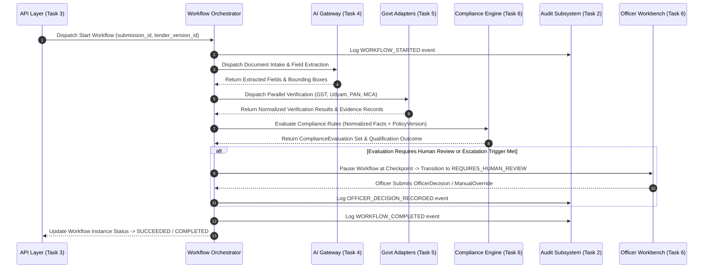

# Phase 1 — High-Level Workflow & Orchestration Architecture

## Overview

The **High-Level Workflow & Orchestration Architecture** defines the central coordination model for the **SIH26100 AI-Powered Integrated Bid Compliance Verification Platform for GeM Procurement**.

The orchestration layer acts as the stateless, event-driven conductor that safely coordinates all platform subsystems—from initial bid submission intake through document processing, AI interpretation, fact normalization, external government verification, evidence assembly, deterministic compliance evaluation, risk assessment, human review gates, and authorized procurement officer decision logging.

---

## 1. Core Architectural Axiom & Subsystem Boundaries

The workflow orchestration layer operates in strict compliance with the frozen platform axiom:

```
[AI INTERPRETS] ──► [AUTHORIZED SOURCES VERIFY] ──► [RULES EVALUATE] ──► [EVIDENCE PROVES] ──► [HUMAN APPROVES]
```

### 1.1 Responsibility & Isolation Boundaries
The orchestration layer strictly manages **execution order, state transitions, dependency resolution, failure recovery, and event propagation**. It does **NOT** take ownership of subsystem internal logic:

* **API Layer (Task 3):** Handles REST commands, request authentication, schema validation, and returns async `202 Accepted` job references. The orchestrator receives commands from the API layer.
* **AI Subsystem (Task 4):** Executes document classification, layout parsing, and field extraction via the vendor-agnostic AI Gateway. The orchestrator dispatches extraction tasks to the AI Gateway but does not perform model inference.
* **Government Integration Subsystem (Task 5):** Executes external verification checks via Quad-Mode Adapters (`LIVE`, `SANDBOX`, `MOCK`, `MANUAL_FALLBACK`). The orchestrator coordinates verification dispatch but never directly calls government web APIs.
* **Compliance Engine (Task 6):** Evaluates deterministic Abstract Syntax Trees (ASTs) on schema-validated `NormalizedFact` dictionaries. The orchestrator passes normalized facts to the rule engine but never evaluates rule conditions directly.
* **Evidence & Audit Subsystem (Task 2 & 6):** Records immutable `EvidenceRecord` hashes and appends workflow events to the tamper-evident audit hash-chain.
* **Human Review & Officer Decision (Task 2 & 6):** Escalates ambiguous items to `REQUIRES_HUMAN_REVIEW` and records human officer decisions (`OfficerDecision`).

```
+-------------------------------------------------------------------------------------------------------+
|                                    WORKFLOW ORCHESTRATION LAYER                                       |
+-------------------------------------------------------------------------------------------------------+
        │                   │                    │                    │                   │
        ▼                   ▼                    ▼                    ▼                   ▼
┌───────────────┐   ┌───────────────┐    ┌───────────────┐    ┌───────────────┐   ┌───────────────┐
│ AI Gateway    │   │ Government    │    │ Compliance    │    │ Risk          │   │ Officer       │
│ Subsystem     │   │ Adapters      │    │ Engine        │    │ Assessment    │   │ Workbench     │
│ (Extraction)  │   │ (Verification)│    │ (Rule ASTs)   │    │ (Signals)     │   │ (Review/Sign) │
└───────────────┘   └───────────────┘    └───────────────┘    └───────────────┘   └───────────────┘
```

---

## 2. Conceptual Workflow Entity Taxonomy

To ensure clear domain separation, Task 7 categorizes workflow concepts by their persistence, operational, and transactional characteristics:

| Concept Name | Representation Type | Primary Identifier | Description & Lifecycle Scope |
| :--- | :--- | :--- | :--- |
| **`WorkflowDefinition`** | Configuration / Specification | String Key (e.g., `"WF-BID-VERIFY-v1"`) | Version-controlled DAG specification defining stages, tasks, dependency rules, retry policies, and timeout bounds. |
| **`WorkflowInstance`** | Operational Domain Entity | ULID (`workflow_instance_id`) | Active or historical execution of a workflow for a specific `BidSubmission`. Bound to PostgreSQL `workflow_instances` table. |
| **`WorkflowStage`** | Derived Execution Stage | Enum / String | Grouping of related tasks (e.g., `DOCUMENT_PROCESSING`, `GOVERNMENT_VERIFICATION`). |
| **`WorkflowTask`** | Operational Task Record | ULID (`workflow_task_id`) | Individual executable unit of work within a stage (e.g., `TASK_VERIFY_GSTIN`). |
| **`TaskAttempt`** | Transient Execution Record | ULID (`task_attempt_id`) | Specific execution attempt of a task, capturing execution worker ID, start time, end time, exit code, and error trace. |
| **`WorkflowContext`** | Operational Read/State Model | JSONB Structure | Accumulated state dictionary containing submission ID, tender version ID, policy version ID, fact references, and intermediate statuses. |
| **`WorkflowEvent`** | Audit Event / Message | ULID (`event_id`) | Immutable state transition event emitted to the system bus and written to the tamper-evident audit trail. |

---

## 3. Subsystem Interaction Architecture



---

## 4. Architectural Constraints & Non-Goals

1. **No LLM Autonomous Workflow Control:** AI models do **not** decide workflow execution order, branch routing, or task completion. Workflow DAG traversal is strictly deterministic.
2. **Stateless Worker Execution:** Workflow workers are stateless. All state transitions, checkpoint data, and task statuses are persisted to PostgreSQL before next-stage dispatch.
3. **No In-Memory Only Execution:** Task execution states and task attempt logs must be recorded in durable storage to ensure resilience against worker crashes or infrastructure restarts.
