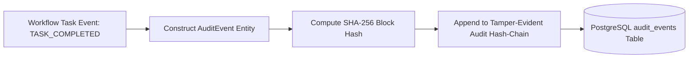

# Phase 1 — Workflow Audit Lineage & Observability Specification

## Overview

The **Workflow Audit Lineage & Observability Specification** defines the end-to-end telemetry, correlation tracking, operational metrics, and audit event mapping within the **SIH26100 Bid Compliance Verification Platform**.

This architecture integrates workflow events directly into the Task 2 tamper-evident audit hash-chain, guaranteeing 100% auditable lineage for CVC vigilance reviews.

---

## 1. 7-Tier Correlation Identifier Taxonomy

To enable trace propagation across distributed API servers, background workers, AI gateways, and government adapters, every workflow request embeds a standardized correlation taxonomy:

```
[Request ID] (req-9912)
   └── [Correlation ID] (corr-8821a90e)
          └── [Submission ID] (01J7SUB001)
                 └── [Workflow Instance ID] (01J7WF001)
                        └── [Workflow Task ID] (01J7TASK001)
                               └── [Task Attempt ID] (01J7ATT001)
                                      └── [Audit Event ID] (01J7EVT001)
```

| Identifier Name | Scope & Purpose | Format / Specification |
| :--- | :--- | :--- |
| **`request_id`** | Scope of single HTTP request ingress. | UUIDv4 string (Header: `X-Request-ID`) |
| **`correlation_id`** | Distributed transaction scope spanning all subsystems. | ULID string (Header: `X-Correlation-ID`) |
| **`submission_id`** | Bidder submission entity boundary. | Crockford Base32 ULID |
| **`workflow_instance_id`**| Master workflow state machine boundary. | Crockford Base32 ULID |
| **`workflow_task_id`** | Granular DAG node execution boundary. | Crockford Base32 ULID |
| **`task_attempt_id`** | Individual execution attempt by worker. | Crockford Base32 ULID |
| **`audit_event_id`** | Immutable tamper-evident audit event block. | Crockford Base32 ULID |

---

## 2. Integration with Tamper-Evident Audit Hash-Chain

Workflow state transitions trigger immutable `AuditEvent` records that are chained directly into the Task 2 audit block:



### 2.1 Audit Block Hash Formula
$$H_n = \text{SHA-256}\Big(H_{n-1} \, \parallel \, \text{event\_id} \, \parallel \, \text{workflow\_instance\_id} \, \parallel \, \text{event\_type} \, \parallel \, \text{timestamp} \, \parallel \, \text{payload\_hash}\Big)$$

Where $H_{n-1}$ is the cryptographic hash of the preceding audit event block, ensuring tamper-evident audit protection.

---

## 3. Workflow Operational Metrics Taxonomy

The orchestrator collects conceptual operational metrics to monitor pipeline performance, SLA compliance, and system bottlenecks:

| Metric Name | Metric Type | Target & Alert Threshold | Observability Purpose |
| :--- | :--- | :--- | :--- |
| **`workflow_execution_duration_seconds`** | Histogram | Alert if P95 > 120s | Measures total end-to-end workflow execution latency. |
| **`task_execution_duration_seconds`** | Histogram | Alert if Task P95 > 15s | Identifies slow tasks or bottlenecks in AI/Govt pipelines. |
| **`workflow_state_total`** | Counter | Monitored by status | Tracks volume of workflows in `SUCCEEDED`, `FAILED`, `CANCELLED`. |
| **`human_review_queue_wait_seconds`** | Gauge / Histogram | Alert if wait > 24 Hours | Measures officer review SLA latency for `WAITING` workflows. |
| **`task_retry_count_total`** | Counter | Alert if retry rate > 5% | Detects transient infrastructure instabilities or network errors. |
| **`partial_completion_rate`** | Gauge | Alert if rate > 10% | Tracks frequency of workflows completing with missing/fallback data. |
