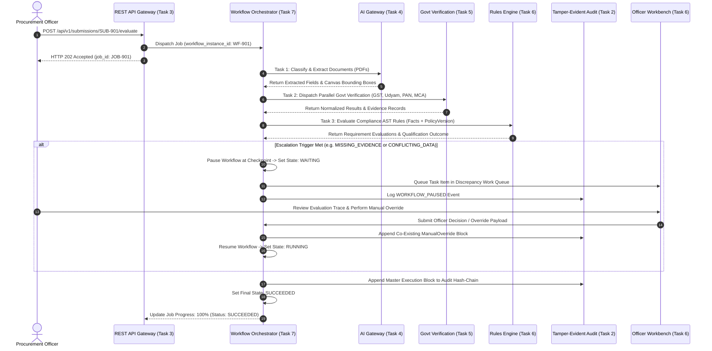

# Phase 1 — End-to-End Workflow Data Flow & Sequence Architecture Specification

## Overview

The **End-to-End Workflow Data Flow Specification** documents the data movement, payload transformations, state persistence, and inter-subsystem data flows across all 12 stages of the **SIH26100 Bid Compliance Verification Platform**.

---

## 1. Master End-to-End Data Flow Architecture

```
[User / GeM API] ──► (POST /evaluate) ──► [API Ingress (Task 3)]
                                                   │
                                                   ▼ (Creates Job & Workflow Instance)
                                     [Workflow Orchestrator (Task 7)]
                                                   │
        ┌───────────────────┬──────────────────────┼──────────────────────┬───────────────────┐
        ▼                   ▼                      ▼                      ▼                   ▼
[Document Intake]   [AI Extraction]        [Govt Adapters]        [Rules Engine]     [Risk Scoring]
(PDFs -> MinIO)     (Fields -> JSON)       (APIs -> Verification) (Facts -> AST)    (Profile -> Score)
        │                   │                      │                      │                   │
        └───────────────────┴──────────────────────┼──────────────────────┴───────────────────┘
                                                   │
                                                   ▼
                                      [Evidence Assembly (Task 5)]
                                                   │
                                                   ▼
                                     [Human Review Gate (Task 6)]
                                                   │
                       ┌───────────────────────────┴───────────────────────────┐
                       ▼ (Escalation Triggered)                                ▼ (Direct Recommendation)
          [Officer Workbench UI (Task 6)]                            [Officer Sign-Off UI]
                       │                                                       │
                       └───────────────────────────┬───────────────────────────┘
                                                   │
                                                   ▼
                                      [Tamper-Evident Audit (Task 2)]
```

---

## 2. Comprehensive Execution Sequence Diagram



---

## 3. Five Primary Execution Paths

1. **Happy Path (Direct Pass):** All documents present $\rightarrow$ AI extraction valid $\rightarrow$ Govt verification verified $\rightarrow$ Compliance rules pass $\rightarrow$ Qualification outcome `QUALIFIED` $\rightarrow$ Direct officer approval $\rightarrow$ Completion.
2. **Missing Evidence Path:** Required document absent $\rightarrow$ Rule returns `MISSING_EVIDENCE` $\rightarrow$ Escalation trigger met $\rightarrow$ Pause at checkpoint (`WAITING`) $\rightarrow$ Officer requests document clarification $\rightarrow$ Resume execution.
3. **Transient Failure Retry Path:** Government API timeout $\rightarrow$ Tier A transient retry triggered $\rightarrow$ Backoff sleep $\rightarrow$ Retry succeeds $\rightarrow$ Workflow resumes automatically.
4. **Manual Fallback Path:** Government API max retries exhausted $\rightarrow$ Activate `MANUAL_FALLBACK` adapter $\rightarrow$ Flag `NOT_VERIFIED` $\rightarrow$ Route item to Officer Workbench for manual document verification.
5. **Two-Phase Cancellation Path:** Officer issues cancel command $\rightarrow$ State transitions to `CANCEL_REQUESTED` $\rightarrow$ Active workers check cancellation flag and abort execution $\rightarrow$ Lock state to `CANCELLED` and write snapshot.
