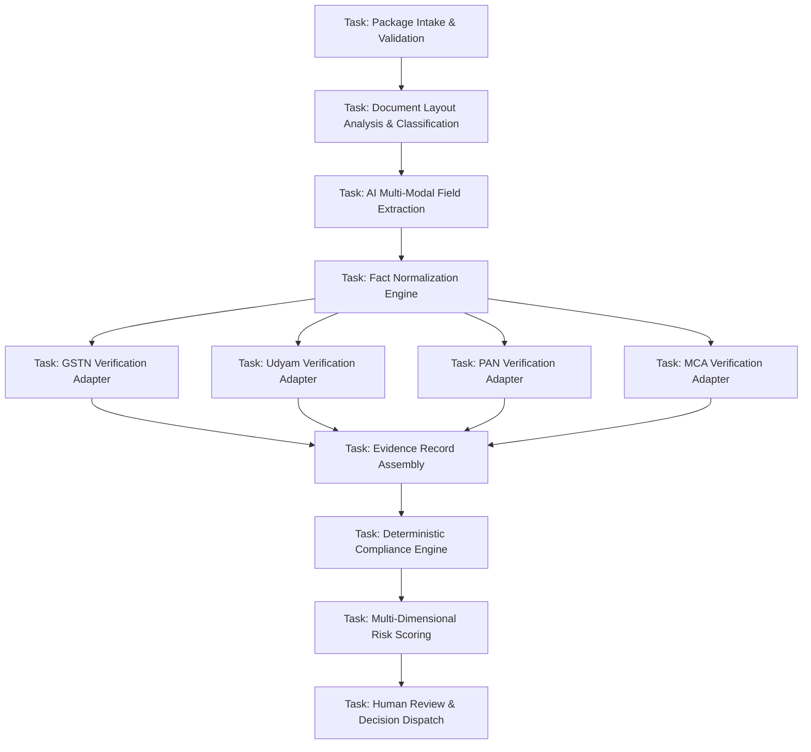

# Phase 1 — Task Dependency Graph (DAG), Concurrency & Cycle Prevention Specification

## Overview

The **Task Dependency Graph (DAG) & Concurrency Specification** defines how workflow tasks are structured as Directed Acyclic Graphs (DAGs), resolved deterministically, executed concurrently where safe, and protected against circular dependencies or race conditions within the **SIH26100 Bid Compliance Verification Platform**.

---

## 1. Workflow Task Dependency Graph (DAG) Architecture

Each `WorkflowDefinition` specifies a collection of tasks connected by dependency edges:

$$G = (V, E)$$

Where $V$ represents the set of `WorkflowTask` execution nodes, and $E$ represents directed dependency edges:

$$E = \{(T_a, T_b) \mid T_b \text{ requires successful completion of } T_a\}$$



---

## 2. Dependency Node Types & Execution Semantics

| Task Node Category | Dependency Pattern | Parallel Execution Eligibility | Blocking / Non-Blocking Semantics |
| :--- | :--- | :--- | :--- |
| **Sequential Task** | Strict single predecessor ($T_a \rightarrow T_b$). | Serial execution only. | Blocking: $T_b$ cannot start until $T_a$ completes. |
| **Fan-Out Parallel Task** | Single predecessor triggers multiple parallel tasks ($T_a \rightarrow \{T_{b1}, T_{b2}, T_{b3}\}$). | **Concurrent Execution Eligible.** | Non-blocking across parallel branch nodes. |
| **Fan-In Aggregation Task** | Multiple parallel predecessors feed single consumer ($\{T_{b1}, T_{b2}\} \rightarrow T_c$). | Serial waiting node. | Blocking: $T_c$ waits for all required upstream nodes. |
| **Conditional Task** | Evaluates applicability predicate before execution. | Depends on branch condition. | Skip Semantics: If non-applicable, task transitions to `NOT_APPLICABLE` without blocking downstream nodes. |

---

## 3. Static Cycle Detection (Tarjan's DAG Validation)

To prevent deadlocks or infinite execution loops, the workflow orchestrator validates the dependency graph using Tarjan's Strongly Connected Components (SCC) algorithm during static workflow registration:

```
[Workflow Definition Input] ──► [Construct Adjacency List Matrix]
                                               │
                                               ▼
[Tarjan's SCC Cycle Detection Algorithm]
                                               │
                     ┌─────────────────────────┴─────────────────────────┐
                     ▼ (Zero Cycles Found - Valid DAG)                   ▼ (Cycle Found: SCC Count > 1)
        [Register Workflow Definition: APPROVED]            [Reject Definition: CYCLE_ERROR]
```

### 3.1 Static Validation Invariant
$$\text{Count}(\text{StronglyConnectedComponents}(G)) \equiv |V|$$

If any strongly connected component contains more than one node ($|SCC| > 1$), a cycle exists (e.g., $T_1 \rightarrow T_2 \rightarrow T_1$), and the workflow definition is rejected with `400 Bad Request` during administrative upload.

---

## 4. Concurrency Control & Race Condition Prevention

When multiple background workers process parallel tasks within the same workflow instance, the orchestrator enforces strict concurrency controls:

1. **Optimistic Row Locking:** Task state updates use PostgreSQL `version` check locks (`UPDATE workflow_tasks SET status = 'COMPLETED', version = version + 1 WHERE task_id = :id AND version = :current_version`).
2. **Distributed Redis Mutex:** Parallel task completion handlers acquire a lightweight Redis lock (`lock:workflow:{id}:fan_in`) before checking fan-in completion criteria.
3. **Idempotent Fan-In Evaluation:** Fan-in tasks verify that all mandatory upstream dependencies are in terminal states (`SUCCEEDED`, `NOT_APPLICABLE`, `PARTIAL`) before initializing downstream tasks.
