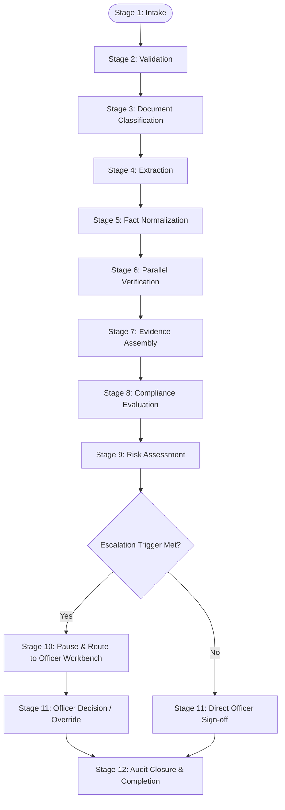

# Phase 1 — Bid Verification Master Workflow Lifecycle Specification

## Overview

The **Bid Verification Master Workflow Lifecycle Specification** defines the end-to-end multi-stage pipeline that processes a bidder submission from intake through document processing, AI extraction, government verification, deterministic compliance scoring, human officer review, and final decision archiving in the **SIH26100 Bid Compliance Verification Platform**.

---

## 1. Master Pipeline Lifecycle Stages

The master workflow for a `BidSubmission` consists of 12 ordered, deterministic stages:

```
[1. Submission Intake] ──► [2. Technical Validation] ──► [3. Document Classification]
                                                                  │
                                                                  ▼
[6. Parallel Govt Verification] ◄── [5. Fact Normalization] ◄── [4. Field Extraction]
              │
              ▼
[7. Evidence Assembly] ──► [8. Rule Evaluation] ──► [9. Risk Assessment]
                                                              │
                                                              ▼
[12. Audit Closure] ◄── [11. Officer Decision] ◄── [10. Human Review Gate]
```

### Stage 1: Submission Intake & Registration
* **Trigger:** Procurement Officer or GeM Integration API submits a `BidSubmission` package (`POST /api/v1/submissions/{id}/evaluate`).
* **Actions:** Instantiate `WorkflowInstance` in state `QUEUED`; generate unique `workflow_id` and `correlation_id`; record initial submission metadata hash.

### Stage 2: Technical Package Validation
* **Actions:** Verify file package integrity (PDF file headers, MIME types, virus scan status, payload size limits); validate tender ID and active `TenderVersion` binding.

### Stage 3: Document Classification & Structural Layout Analysis
* **Actions:** Dispatch uploaded PDFs to AI Gateway for document classification (e.g., Audited Balance Sheet, GST Certificate, Udyam Registration, PAN Card, OEM Authorization).

### Stage 4: Multi-Modal Field Extraction
* **Actions:** AI Gateway extracts key-value pairs, tables, dates, and numbers with canvas bounding box coordinates (`bbox`). Raw values are linked to preliminary `ExtractedField` entities.

### Stage 5: Fact Normalization & Quality Scoring
* **Actions:** Fact Normalization Engine maps raw extracted fields to canonical `NormalizedFact` objects. Computes data quality scores, freshness indicators, and initial status flags.

### Stage 6: Parallel Government Verification Dispatch
* **Actions:** Orchestrator dispatches parallel async verification tasks across authorized government adapters (`GSTN`, `Udyam`, `PAN`, `MCA`, `EPFO`, `ESIC`, `DPIIT`, `Debarment`).

### Stage 7: Evidence Assembly & Provenance Linkage
* **Actions:** Consolidate verified government results and extracted document facts into tamper-evident `EvidenceRecord` items. Generate cryptographic SHA-256 hashes for all evidence payloads.

### Stage 8: Deterministic Compliance Rule Evaluation
* **Actions:** Invoke the Deterministic Compliance Engine (Task 6). Evaluate schema-validated AST rules against `NormalizedFact` items bound to active `PolicyVersion` and `TenderVersion`.

### Stage 9: Multi-Dimensional Risk Assessment
* **Actions:** Risk Engine (Task 2 & 4) computes `RiskAssessmentProfile` and `RiskFactorSignal` metrics based on compliance evaluations, verification mismatches, and historical risk indicators.

### Stage 10: Human Review Gate Inspection
* **Actions:** Inspect evaluation results and risk profiles. If any escalation trigger is met (e.g., `MISSING_EVIDENCE`, `CONFLICTING_EVIDENCE`, `AMBIGUOUS_IDENTITY`), pause workflow at checkpoint and transition to `REQUIRES_HUMAN_REVIEW`.

### Stage 11: Officer Decision & Manual Override Recording
* **Actions:** Procurement Officer reviews deterministic traces, evidence citations, and risk scores in the Workbench UI. Officer enters formal `OfficerDecision` (`QUALIFIED` / `NOT_QUALIFIED`). If overriding machine recommendation, a co-existing `ManualOverride` block is generated.

### Stage 12: Audit Hash-Chain Closure & Completion
* **Actions:** Finalize `WorkflowInstance` state to `SUCCEEDED` or `COMPLETED`. Append master execution block to the tamper-evident audit hash-chain. Emit completion notification.

---

## 2. Dynamic Workflow Branching Matrix

The workflow does not follow a rigid linear path for all tenders. Branching logic dynamically executes tasks based on tender requirements, bidder entity classification, and evidence status:



| Operational Condition | Workflow Branch / Path | Resulting State Transition |
| :--- | :--- | :--- |
| **All Facts Verified & Rules Passed** | Direct path to Stage 11 recommendation. | `RUNNING` $\rightarrow$ `DECISION_PENDING` |
| **Missing Mandatory Evidence** | Route to Stage 10 Human Review Gate. | `RUNNING` $\rightarrow$ `WAITING_FOR_REVIEW` |
| **Government Portal Timeout / Outage** | Activate Retry Policy $\rightarrow$ Fallback to `MANUAL_FALLBACK`. | `RUNNING` $\rightarrow$ `PARTIAL` $\rightarrow$ `WAITING_FOR_REVIEW` |
| **MSME Exemption Applicable** | Bypass EMD Fee Verification Task. | Task marked `NOT_APPLICABLE` |
| **Disqualifying Violation Proven** | Flag `NOT_QUALIFIED` recommendation $\rightarrow$ Route to Officer. | `RUNNING` $\rightarrow$ `DECISION_PENDING` |
| **Workflow Cancelled by Officer** | Execute Two-Phase Cancellation. | `RUNNING` $\rightarrow$ `CANCEL_REQUESTED` $\rightarrow$ `CANCELLED` |

---

## 3. Workflow Snapshot & Reproducibility Preservation

To ensure legal auditability during CVC vigilance reviews, every completed workflow instance generates a master execution snapshot:

* **`workflow_instance_id`:** ULID identifier.
* **`submission_id`:** Bound bidder submission ID.
* **`tender_version_id` & `corrigendum_ids`:** Bound tender version references.
* **`policy_version_id`:** Active policy version reference.
* **`task_execution_log`:** Array of all task attempts, start/end timestamps, exit codes, and worker IDs.
* **`snapshot_hash`:** Cryptographic SHA-256 hash of the complete workflow state payload, anchored in the audit hash-chain.
