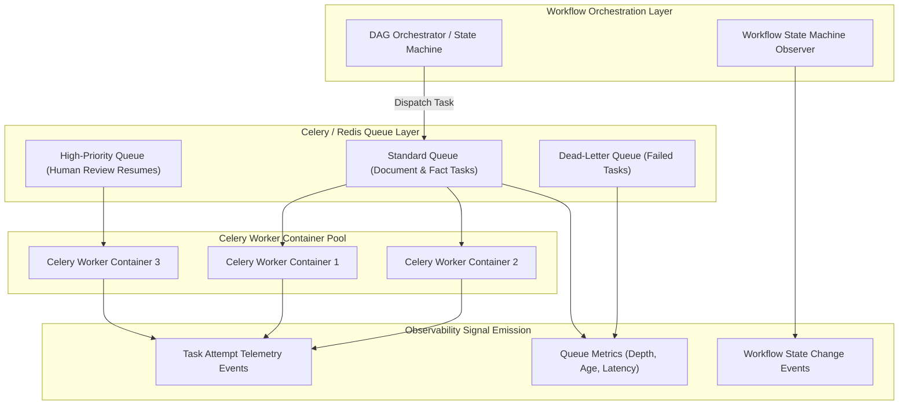
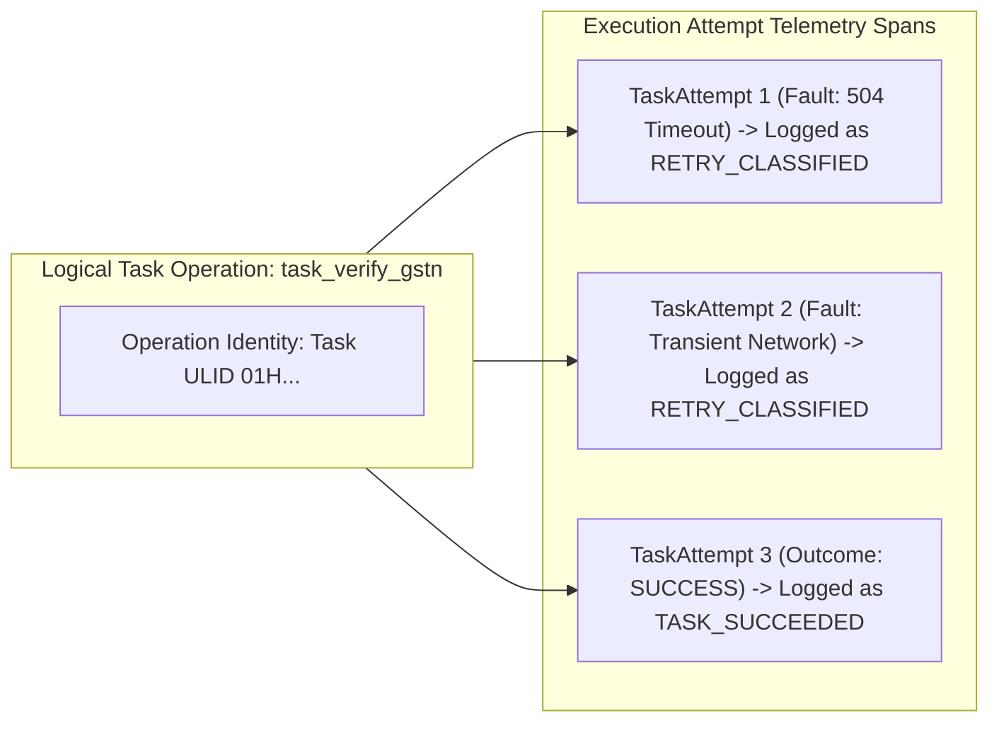

# Phase 1 — Workflow Orchestration & Celery Observability Architecture

**Document Control Information**
- **Project Name:** SIH26100 — AI-Powered Integrated Bid Compliance Verification Platform for GeM Procurement
- **Organization:** Ministry of Petroleum & Natural Gas / CPCL
- **Document Version:** 1.0.0 (Phase 1 — Task 9 Workflow Observability Specification)
- **Status:** DESIGN DRAFT / PENDING REVIEW
- **Security Classification:** INTERNAL
- **Mode:** DESIGN ONLY — ZERO CODE IMPLEMENTATION

---

## 1. Executive Summary & Purpose

This specification defines the observability architecture for the Workflow Orchestrator and Celery background task queue subsystem. As established in Task 7, bid compliance verification workflows execute as Directed Acyclic Graphs (DAGs) of asynchronous tasks. Observability must monitor queue health, task execution throughput, worker availability, state machine transitions, retry backoffs, checkpoint pauses, and two-phase cancellations.

The core workflow observability principle is:
> **"Workflow observability tracks DAG task execution health, queue depth, and worker throughput while explicitly preserving Task 7 semantics: distinguishing operation identity from retry TaskAttempts, tracking idempotency locks, and monitoring human-review checkpoint pauses."**

---

## 2. Workflow Telemetry Topology & Signal Flow

---

## 3. Workflow & Celery Telemetry Metrics

| Metric Name | Type & Unit | Label Dimensions | Target Health Threshold | Alert Relationship |
|---|---|---|---|---|
| `celery_queue_depth` | Gauge (Count) | `queue_name`, `environment` | Depth $< 500$ items | `WORKFLOW_QUEUE_BACKLOG_WARN` ($> 500$) |
| `celery_task_age_seconds` | Histogram (Seconds) | `queue_name`, `task_name` | Age $< 30$ seconds | `WORKFLOW_TASK_STUCK_WARN` ($> 60s$) |
| `celery_worker_active_count` | Gauge (Count) | `worker_node`, `queue_name` | Count $\ge$ Min Baseline | `WORKFLOW_WORKER_OUTAGE_CRITICAL` |
| `workflow_execution_duration_seconds` | Histogram (Seconds) | `workflow_type`, `status` | Duration $< 300$ seconds | `WORKFLOW_EXECUTION_LATENCY_HIGH` |
| `workflow_state_transitions_total` | Counter (Count) | `workflow_type`, `from_state`, `to_state` | Normal state distribution | Anomaly detection on state aborts |
| `task_attempt_retries_total` | Counter (Count) | `task_name`, `fault_tier` | Retry rate $< 5\%$ | `TASK_RETRY_SPIKE_WARN` ($> 10\%$) |
| `workflow_idempotency_conflicts_total` | Counter (Count) | `endpoint`, `action` | Conflict rate $< 1\%$ | `IDEMPOTENCY_CONFLICT_SPIKE` |
| `workflow_checkpoint_pauses_total` | Counter (Count) | `pause_reason` | Correlates with review queue | Tracking human review queue depth |
| `workflow_cancellations_total` | Counter (Count) | `cancellation_reason` | Low rate | Tracking user cancellation requests |

---

## 4. Operation Identity vs. Retry `TaskAttempt` Telemetry

Preserving Task 7 specifications, observability must not confuse a legitimate task attempt retry with a duplicate logical operation:

### 4.1 Retry Logging Rules
1. **Attempt Lineage:** Every retry log includes `task_attempt_id`, `attempt_number` (1, 2, 3), and `fault_tier` (`TRANSIENT`, `PERMANENT`, `GOVT_BUSINESS_RESULT`, `HUMAN_REVIEW_REQUIRED`).
2. **Backoff Tracking:** Retries log calculated backoff delay and equal jitter seconds (`backoff_delay_sec: 12.4`).
3. **Idempotency Locks:** Re-executed tasks verify idempotency locks (`X-Idempotency-Key`) in Redis before processing, logging `IDEMPOTENCY_LOCK_VERIFIED`.

---

## 5. Checkpoint Pause, Resume & Cancellation Observability

- **Checkpoint Pause Telemetry:** When a workflow pauses for human officer review, it emits a `WORKFLOW_CHECKPOINT_PAUSED` event capturing:
  - `workflow_instance_ulid`
  - `pause_reason` (e.g., `MISSING_EVIDENCE`, `UNCERTAIN_FACT`, `HIGH_RISK_BIDDER`)
  - `review_queue_id`
  - `snapshot_ulid`
- **Resume Telemetry:** Upon officer signoff, the worker resuming the workflow emits `WORKFLOW_CHECKPOINT_RESUMED` capturing `officer_ulid` and `officer_decision_ulid`.
- **Two-Phase Cancellation Telemetry:** When cancellation is requested, workers log `WORKFLOW_CANCEL_REQUESTED`, complete in-flight tasks cleanly, release DB locks, and log `WORKFLOW_CANCELLED`.
