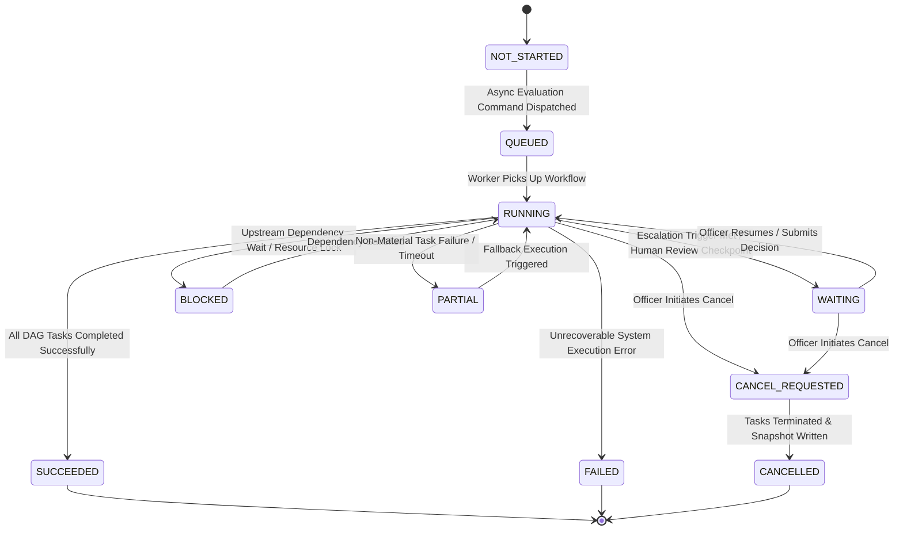

# Phase 1 — Multi-Dimensional Workflow State Machine Specification

## Overview

The **Multi-Dimensional Workflow State Machine Specification** defines the formal state transitions, state isolation boundaries, transition guards, and legal state graphs within the **SIH26100 Bid Compliance Verification Platform**.

This architecture explicitly isolates **Workflow Execution State**, **Business Domain State**, **Compliance Evaluation Status**, **Qualification Outcome**, and **Officer Decision** to prevent status ambiguity or invalid automated state corruption.

---

## 1. Multi-Dimensional State Isolation Boundary

> [!CRITICAL]
> **PROHIBITION OF STATUS COLLAPSE:**
> The system strictly forbids collapsing technical execution state, business domain state, requirement compliance status, qualification outcomes, and human officer decisions into a single generic status column.
> Each dimension represents an isolated concept in the domain model with dedicated transition rules.

```
┌──────────────────────────────────────────────────────────────────────────────────────────────────┐
│                                FIVE-DIMENSIONAL STATE ARCHITECTURE                               │
├───────────────────────────────┬──────────────────────────────────────────────────────────────────┤
│ 1. Workflow Execution State   │ `NOT_STARTED` ──► `QUEUED` ──► `RUNNING` ──► `SUCCEEDED` / `FAILED` │
├───────────────────────────────┼──────────────────────────────────────────────────────────────────┤
│ 2. Business Domain State      │ `DRAFT` ──► `SUBMITTED` ──► `UNDER_REVIEW` ──► `COMPLETED`       │
├───────────────────────────────┼──────────────────────────────────────────────────────────────────┤
│ 3. Compliance Status (Task 6) │ `PASS` / `FAIL` / `MISSING_EVIDENCE` / `REQUIRES_HUMAN_REVIEW`   │
├───────────────────────────────┼──────────────────────────────────────────────────────────────────┤
│ 4. Qualification Outcome      │ `QUALIFIED` / `NOT_QUALIFIED` / `PENDING_REVIEW`                │
├───────────────────────────────┼──────────────────────────────────────────────────────────────────┤
│ 5. Officer Decision (Task 2)  │ Authorized Human Action: `APPROVED` / `REJECTED` / `OVERRIDDEN`  │
└───────────────────────────────┴──────────────────────────────────────────────────────────────────┘
```

---

## 2. Workflow Execution State Machine

The `WorkflowInstance` execution state machine governs technical pipeline execution:



---

## 3. Workflow State Transition Matrix

| Current State | Target State | Triggering Event | Transition Guard & Capability Requirement | Audit Event Generated |
| :--- | :--- | :--- | :--- | :--- |
| **`NOT_STARTED`** | **`QUEUED`** | API command `POST /evaluate` | Idempotency check pass; `TenderVersion` active. | `AUDIT_WF_QUEUED` |
| **`QUEUED`** | **`RUNNING`** | Worker dequeues task | Execution worker lock acquired. | `AUDIT_WF_STARTED` |
| **`RUNNING`** | **`WAITING`** | Escalation trigger met | `requires_human_review == True` flag set. | `AUDIT_WF_PAUSED_REVIEW` |
| **`WAITING`** | **`RUNNING`** | Officer decision submitted | Authorized officer token; decision payload. | `AUDIT_WF_RESUMED` |
| **`RUNNING`** | **`PARTIAL`** | Non-critical task timeout | Task severity marked `NON_MATERIAL_REVIEW`. | `AUDIT_WF_PARTIAL_EXEC` |
| **`RUNNING`** | **`SUCCEEDED`** | Final DAG task complete | 100% DAG node completion; zero unhandled errors. | `AUDIT_WF_SUCCEEDED` |
| **`RUNNING`** | **`FAILED`** | Critical system error | Unhandled system exception or database crash. | `AUDIT_WF_FAILED` |
| **`RUNNING`** / **`WAITING`** | **`CANCEL_REQUESTED`** | Cancel API command | Authorized Procurement Officer capability. | `AUDIT_WF_CANCEL_REQ` |
| **`CANCEL_REQUESTED`** | **`CANCELLED`** | Tasks terminated | Worker execution loop exited; snapshot locked. | `AUDIT_WF_CANCELLED` |

---

## 4. Invalid State Transitions & Protection Rules

The state machine strictly enforces invariant protection rules to prevent state corruption:

1. **Terminal State Lock:** Terminal states (`SUCCEEDED`, `FAILED`, `CANCELLED`) are permanently immutable. A closed workflow instance can **NEVER** transition back to `RUNNING` or `QUEUED`. (Re-evaluation requires creating a new `WorkflowInstance`).
2. **No Direct Transition to Compliance Status:** A workflow state transition (`RUNNING` $\rightarrow$ `SUCCEEDED`) does **NOT** mutate individual `ComplianceEvaluation` statuses (`PASS`/`FAIL`).
3. **No Direct Transition to Qualification Outcome:** Workflow state `SUCCEEDED` does **NOT** automatically mean bidder `QUALIFIED`. Qualification outcome is derived independently by aggregating compliance evaluations.
4. **Technical Failure Isolation:** Transition to `FAILED` indicates a technical execution outage, **NEVER** a compliance failure or bidder disqualification.
